# Untitled

## SnapLogic Documentation Style Guide Single-Pager

This document lists out the writing and stylistic guidelines that the SnapLogic Documentation team recommends for all its output. Compiled by collating guidance received from team members, this is a living document. If you have any concerns with the guidance provided here, or if you wish to make any recommendations for enhancement, please mail [documentation@snaplogic.com](mailto:documentation@snaplogic.com).

* [Documentation Conventions](https://mysnaplogic.atlassian.net/wiki/spaces/DT/pages/585596949/SnapLogic+Documentation+Style+Guide+Single-Pager#SnapLogicDocumentationStyleGuideSingle-Pager-DocumentationConventions)
  * [Overarching Guidelines](https://mysnaplogic.atlassian.net/wiki/spaces/DT/pages/585596949/SnapLogic+Documentation+Style+Guide+Single-Pager#SnapLogicDocumentationStyleGuideSingle-Pager-OverarchingGuidelines)
  * [Commonly-Used Phrases in SnapLogic Documentation](https://mysnaplogic.atlassian.net/wiki/spaces/DT/pages/585596949/SnapLogic+Documentation+Style+Guide+Single-Pager#SnapLogicDocumentationStyleGuideSingle-Pager-Commonly-UsedPhrasesinSnapLogicDocumentation)
  * [Documentation Templates](https://mysnaplogic.atlassian.net/wiki/spaces/DT/pages/585596949/SnapLogic+Documentation+Style+Guide+Single-Pager#SnapLogicDocumentationStyleGuideSingle-Pager-DocumentationTemplates)
  * [The SnapLogic Documentation Library of Words](https://mysnaplogic.atlassian.net/wiki/spaces/DT/pages/585596949/SnapLogic+Documentation+Style+Guide+Single-Pager#SnapLogicDocumentationStyleGuideSingle-Pager-TheSnapLogicDocumentationLibraryofWords)
  * [Sample Data and Example Names](https://mysnaplogic.atlassian.net/wiki/spaces/DT/pages/585596949/SnapLogic+Documentation+Style+Guide+Single-Pager#SnapLogicDocumentationStyleGuideSingle-Pager-SampleDataandExampleNames)
  * [Table of Contents](https://mysnaplogic.atlassian.net/wiki/spaces/DT/pages/585596949/SnapLogic+Documentation+Style+Guide+Single-Pager#SnapLogicDocumentationStyleGuideSingle-Pager-TableofContents)
  * [Working with Excerpts](https://mysnaplogic.atlassian.net/wiki/spaces/DT/pages/585596949/SnapLogic+Documentation+Style+Guide+Single-Pager#SnapLogicDocumentationStyleGuideSingle-Pager-WorkingwithExcerpts)
  * [Working with Screenshots](https://mysnaplogic.atlassian.net/wiki/spaces/DT/pages/585596949/SnapLogic+Documentation+Style+Guide+Single-Pager#SnapLogicDocumentationStyleGuideSingle-Pager-WorkingwithScreenshots)
  * [Documenting Buttons and Icons](https://mysnaplogic.atlassian.net/wiki/spaces/DT/pages/585596949/SnapLogic+Documentation+Style+Guide+Single-Pager#SnapLogicDocumentationStyleGuideSingle-Pager-DocumentingButtonsandIcons)
  * [Documenting Snap Properties](https://mysnaplogic.atlassian.net/wiki/spaces/DT/pages/585596949/SnapLogic+Documentation+Style+Guide+Single-Pager#SnapLogicDocumentationStyleGuideSingle-Pager-DocumentingSnapProperties)
  * [Documenting Snap Input and Output](https://mysnaplogic.atlassian.net/wiki/spaces/DT/pages/585596949/SnapLogic+Documentation+Style+Guide+Single-Pager#SnapLogicDocumentationStyleGuideSingle-Pager-DocumentingSnapInputandOutput)
  * [Documenting Snap Settings](https://mysnaplogic.atlassian.net/wiki/spaces/DT/pages/585596949/SnapLogic+Documentation+Style+Guide+Single-Pager#SnapLogicDocumentationStyleGuideSingle-Pager-DocumentingSnapSettings)
  * [Documenting Procedures](https://mysnaplogic.atlassian.net/wiki/spaces/DT/pages/585596949/SnapLogic+Documentation+Style+Guide+Single-Pager#SnapLogicDocumentationStyleGuideSingle-Pager-DocumentingProcedures)
  * [Examples and Use Cases in Documentation](https://mysnaplogic.atlassian.net/wiki/spaces/DT/pages/585596949/SnapLogic+Documentation+Style+Guide+Single-Pager#SnapLogicDocumentationStyleGuideSingle-Pager-ExamplesandUseCasesinDocumentation)
  * [Links in Your Documentation](https://mysnaplogic.atlassian.net/wiki/spaces/DT/pages/585596949/SnapLogic+Documentation+Style+Guide+Single-Pager#SnapLogicDocumentationStyleGuideSingle-Pager-LinksinYourDocumentation)
  * [Referring to File Types and Extensions](https://mysnaplogic.atlassian.net/wiki/spaces/DT/pages/585596949/SnapLogic+Documentation+Style+Guide+Single-Pager#SnapLogicDocumentationStyleGuideSingle-Pager-ReferringtoFileTypesandExtensions)
  * [Acronyms and Abbreviations](https://mysnaplogic.atlassian.net/wiki/spaces/DT/pages/585596949/SnapLogic+Documentation+Style+Guide+Single-Pager#SnapLogicDocumentationStyleGuideSingle-Pager-AcronymsandAbbreviations)
* [Page Structure and Hierarchy](https://mysnaplogic.atlassian.net/wiki/spaces/DT/pages/585596949/SnapLogic+Documentation+Style+Guide+Single-Pager#SnapLogicDocumentationStyleGuideSingle-Pager-PageStructureandHierarchy)
  * [Heading 1](https://mysnaplogic.atlassian.net/wiki/spaces/DT/pages/585596949/SnapLogic+Documentation+Style+Guide+Single-Pager#SnapLogicDocumentationStyleGuideSingle-Pager-Heading1)
  * [Heading 2](https://mysnaplogic.atlassian.net/wiki/spaces/DT/pages/585596949/SnapLogic+Documentation+Style+Guide+Single-Pager#SnapLogicDocumentationStyleGuideSingle-Pager-Heading2)
  * [Heading 3 and Below](https://mysnaplogic.atlassian.net/wiki/spaces/DT/pages/585596949/SnapLogic+Documentation+Style+Guide+Single-Pager#SnapLogicDocumentationStyleGuideSingle-Pager-Heading3andBelow)
* [Formatting Guidelines](https://mysnaplogic.atlassian.net/wiki/spaces/DT/pages/585596949/SnapLogic+Documentation+Style+Guide+Single-Pager#SnapLogicDocumentationStyleGuideSingle-Pager-FormattingGuidelines)
  * [Capitalization Conventions](https://mysnaplogic.atlassian.net/wiki/spaces/DT/pages/585596949/SnapLogic+Documentation+Style+Guide+Single-Pager#SnapLogicDocumentationStyleGuideSingle-Pager-CapitalizationConventions)
  * [Headings](https://mysnaplogic.atlassian.net/wiki/spaces/DT/pages/585596949/SnapLogic+Documentation+Style+Guide+Single-Pager#SnapLogicDocumentationStyleGuideSingle-Pager-Headings)
  * [Bold Font Usage](https://mysnaplogic.atlassian.net/wiki/spaces/DT/pages/585596949/SnapLogic+Documentation+Style+Guide+Single-Pager#SnapLogicDocumentationStyleGuideSingle-Pager-BoldFontUsage)
  * [Italics Font Usage](https://mysnaplogic.atlassian.net/wiki/spaces/DT/pages/585596949/SnapLogic+Documentation+Style+Guide+Single-Pager#SnapLogicDocumentationStyleGuideSingle-Pager-ItalicsFontUsage)
  * [Formatting Code](https://mysnaplogic.atlassian.net/wiki/spaces/DT/pages/585596949/SnapLogic+Documentation+Style+Guide+Single-Pager#SnapLogicDocumentationStyleGuideSingle-Pager-FormattingCode)
  * [Formatting Variables](https://mysnaplogic.atlassian.net/wiki/spaces/DT/pages/585596949/SnapLogic+Documentation+Style+Guide+Single-Pager#SnapLogicDocumentationStyleGuideSingle-Pager-FormattingVariables)
  * [Menu Paths](https://mysnaplogic.atlassian.net/wiki/spaces/DT/pages/585596949/SnapLogic+Documentation+Style+Guide+Single-Pager#SnapLogicDocumentationStyleGuideSingle-Pager-MenuPaths)
  * [Formatting Pipelines](https://mysnaplogic.atlassian.net/wiki/spaces/DT/pages/585596949/SnapLogic+Documentation+Style+Guide+Single-Pager#SnapLogicDocumentationStyleGuideSingle-Pager-FormattingPipelines)
  * [Notes](https://mysnaplogic.atlassian.net/wiki/spaces/DT/pages/585596949/SnapLogic+Documentation+Style+Guide+Single-Pager#SnapLogicDocumentationStyleGuideSingle-Pager-Notes)
  * [Formatting User-entered Values](https://mysnaplogic.atlassian.net/wiki/spaces/DT/pages/585596949/SnapLogic+Documentation+Style+Guide+Single-Pager#SnapLogicDocumentationStyleGuideSingle-Pager-FormattingUser-enteredValues)
* [Punctuation Guidelines](https://mysnaplogic.atlassian.net/wiki/spaces/DT/pages/585596949/SnapLogic+Documentation+Style+Guide+Single-Pager#SnapLogicDocumentationStyleGuideSingle-Pager-PunctuationGuidelines)
  * [Commas](https://mysnaplogic.atlassian.net/wiki/spaces/DT/pages/585596949/SnapLogic+Documentation+Style+Guide+Single-Pager#SnapLogicDocumentationStyleGuideSingle-Pager-Commas)
  * [Hyphens and Dashes](https://mysnaplogic.atlassian.net/wiki/spaces/DT/pages/585596949/SnapLogic+Documentation+Style+Guide+Single-Pager#SnapLogicDocumentationStyleGuideSingle-Pager-HyphensandDashes)
  * [Semi-Colons](https://mysnaplogic.atlassian.net/wiki/spaces/DT/pages/585596949/SnapLogic+Documentation+Style+Guide+Single-Pager#SnapLogicDocumentationStyleGuideSingle-Pager-Semi-Colons)
  * [Spacing](https://mysnaplogic.atlassian.net/wiki/spaces/DT/pages/585596949/SnapLogic+Documentation+Style+Guide+Single-Pager#SnapLogicDocumentationStyleGuideSingle-Pager-Spacing)
  * [Colons](https://mysnaplogic.atlassian.net/wiki/spaces/DT/pages/585596949/SnapLogic+Documentation+Style+Guide+Single-Pager#SnapLogicDocumentationStyleGuideSingle-Pager-Colons)
* [Stylistic Guidelines](https://mysnaplogic.atlassian.net/wiki/spaces/DT/pages/585596949/SnapLogic+Documentation+Style+Guide+Single-Pager#SnapLogicDocumentationStyleGuideSingle-Pager-StylisticGuidelines)
  * [Avoid "\(s\)" to refer to one or more items](https://mysnaplogic.atlassian.net/wiki/spaces/DT/pages/585596949/SnapLogic+Documentation+Style+Guide+Single-Pager#SnapLogicDocumentationStyleGuideSingle-Pager-Avoid%22%28s%29%22torefertooneormoreitems)
  * [Avoid Latinates \(i.e., e.g., etc.\)](https://mysnaplogic.atlassian.net/wiki/spaces/DT/pages/585596949/SnapLogic+Documentation+Style+Guide+Single-Pager#SnapLogicDocumentationStyleGuideSingle-Pager-AvoidLatinates%28i.e.,e.g.,etc.%29)
  * [Voice](https://mysnaplogic.atlassian.net/wiki/spaces/DT/pages/585596949/SnapLogic+Documentation+Style+Guide+Single-Pager#SnapLogicDocumentationStyleGuideSingle-Pager-Voice)
  * [Word Choice](https://mysnaplogic.atlassian.net/wiki/spaces/DT/pages/585596949/SnapLogic+Documentation+Style+Guide+Single-Pager#SnapLogicDocumentationStyleGuideSingle-Pager-WordChoice)
  * [Working with Lists](https://mysnaplogic.atlassian.net/wiki/spaces/DT/pages/585596949/SnapLogic+Documentation+Style+Guide+Single-Pager#SnapLogicDocumentationStyleGuideSingle-Pager-WorkingwithLists)
  * [Tense usage](https://mysnaplogic.atlassian.net/wiki/spaces/DT/pages/585596949/SnapLogic+Documentation+Style+Guide+Single-Pager#SnapLogicDocumentationStyleGuideSingle-Pager-Tenseusage)
* [SnapLogic Terminology](https://mysnaplogic.atlassian.net/wiki/spaces/DT/pages/585596949/SnapLogic+Documentation+Style+Guide+Single-Pager#SnapLogicDocumentationStyleGuideSingle-Pager-SnapLogicTerminology)
* [Standards for UI Strings and Messages](https://mysnaplogic.atlassian.net/wiki/spaces/DT/pages/585596949/SnapLogic+Documentation+Style+Guide+Single-Pager#SnapLogicDocumentationStyleGuideSingle-Pager-StandardsforUIStringsandMessages)
  * [Standards for UI Strings](https://mysnaplogic.atlassian.net/wiki/spaces/DT/pages/585596949/SnapLogic+Documentation+Style+Guide+Single-Pager#SnapLogicDocumentationStyleGuideSingle-Pager-StandardsforUIStrings)
  * [Standards for Error Messages](https://mysnaplogic.atlassian.net/wiki/spaces/DT/pages/585596949/SnapLogic+Documentation+Style+Guide+Single-Pager#SnapLogicDocumentationStyleGuideSingle-Pager-SEMStandardsforErrorMessages)
* [Working with Samples](https://mysnaplogic.atlassian.net/wiki/spaces/DT/pages/585596949/SnapLogic+Documentation+Style+Guide+Single-Pager#SnapLogicDocumentationStyleGuideSingle-Pager-WorkingwithSamples)
  * [Saving Finalized Samples](https://mysnaplogic.atlassian.net/wiki/spaces/DT/pages/585596949/SnapLogic+Documentation+Style+Guide+Single-Pager#SnapLogicDocumentationStyleGuideSingle-Pager-SavingFinalizedSamples)
  * [Naming Samples in SnapLogic](https://mysnaplogic.atlassian.net/wiki/spaces/DT/pages/585596949/SnapLogic+Documentation+Style+Guide+Single-Pager#SnapLogicDocumentationStyleGuideSingle-Pager-NamingSamplesinSnapLogic)
  * [Exporting and Renaming Samples in the Documentation](https://mysnaplogic.atlassian.net/wiki/spaces/DT/pages/585596949/SnapLogic+Documentation+Style+Guide+Single-Pager#SnapLogicDocumentationStyleGuideSingle-Pager-ExportingandRenamingSamplesintheDocumentation)
  * [Preparing Samples for Upload](https://mysnaplogic.atlassian.net/wiki/spaces/DT/pages/585596949/SnapLogic+Documentation+Style+Guide+Single-Pager#SnapLogicDocumentationStyleGuideSingle-Pager-PreparingSamplesforUpload)

## Documentation Conventions

This section of the style guide offers guidance on the conventions that we use for our documentation. Basically, this section contains guidance that is integral to the way we document things at SnapLogic.

### Overarching Guidelines

* Use approved doc templates for all your topics.
* Avoid using quotes \(single and double\) unless it is part of code.
* Keep sentences as short as possible. Avoid redundant text.
* Avoid negative constructions.
* Avoid contractions.
* Use the complete name of a proprietary term the first time it is used in a document. Enter the shortened form of the term in parentheses after the first usage. Use the shortened form thereafter.
* Use the second person singular \(you\) to refer to the user, and the first person plural \(we\) when referring to SnapLogic.
* Use [/wiki/spaces/Marketing/pages/757563495](file:///C:/wiki/spaces/Marketing/pages/757563495) for color used in diagrams and screenshot highlights.
* Avoid using '/'; use 'or' instead.
* Follow the specifications in the [/wiki/spaces/Marketing/pages/757563495](file:///C:/wiki/spaces/Marketing/pages/757563495).

### Commonly-Used Phrases in SnapLogic Documentation

See [Commonly-Used Phrases in SnapLogic Documentation](file:///C:/wiki/spaces/DT/pages/906233371/Commonly-Used+Phrases+in+SnapLogic+Documentation)

### Documentation Templates

Templates are a technical writer's best friend. Approved documentation templates are typically created–and reviewed–by the SnapLogic Documentation team; they also have the agreement and support of the development and product manager.

Always check for and use the documentation template associated with the type of topic you are creating. This will simplify and enhance your work; this will also save you from unnecessary overwriting later.

#### Approved SnapLogic documentation templates

Here are the approved templates:

| **Page Type** | **Template** |
| :--- | :--- |
| Snap Pack doc | 000-XYZ Snap Pack |
| Snap Pack account landing page | 010-Configuring &lt;Snap Pack Name&gt; Accounts |
| Account type doc | 011 Account Type 1 |
| Snap doc | 02-Snap |
| Snap Pack use case doc | 06-XYZ Snap Pack Use Cases |

The names of some of these templates may change over time. If you are unable to find a particular template, mail documentation@snaplogic.com.

#### Selecting the template

You can apply templates only to new pages. Once the page is created, and you want to use an existing template, you need to copy and paste each element of the template into the page. So, it's important that we do this right the first time!

To choose a template:

1. Click **+** in the sidebar. The Create dialog appears.
2. From the **Select space** drop-down list, select the space in which you want to create the document. In our context, it's typically the [WIP space](https://docs-snaplogic.atlassian.net/wiki/spaces/DRWIP/overview). This refreshes the list of templates displayed in the dialog, and the templates available in the WIP space appear.
3. Select the template that you want to use and click **Create**.

#### Updating templates

Templates reflect evolving documentation requirements, and may need updates from time to time.

If you feel that a particular template needs changes, mail your suggestions to the [Documentation Team](mailto:documentation@snaplogic.com).

### The SnapLogic Documentation Library of Words

Apart from the terms listed below, refer to the [/wiki/spaces/Marketing/pages/757563495](file:///C:/wiki/spaces/Marketing/pages/757563495) &gt; SnapLogic Company and Product Names section for SnapLogic-specific terms.

This section lists out the terms used to refer to specific SnapLogic user interface elements.

<table>
  <thead>
    <tr>
      <th style="text-align:left"><b>UI Element</b>
      </th>
      <th style="text-align:left"><b>Description</b>
      </th>
      <th style="text-align:left"><b>Example</b>
      </th>
    </tr>
  </thead>
  <tbody>
    <tr>
      <td style="text-align:left">Window</td>
      <td style="text-align:left">
        
A window is typically a rectangular frame within which content is presented,
          independent of the contents in the remainder of the screen. Compare with
          a dialog, which displays content that is related to another UI element.
          Windows can typically be resized and minimized (unless they are configured
          to display in full-screen mode.

        
The SnapLogic UI can be viewed using a browser window.

      </td>
      <td style="text-align:left">
        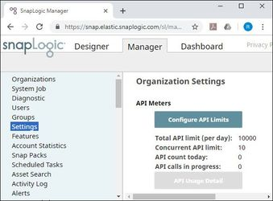
      </td>
    </tr>
    <tr>
      <td style="text-align:left">Page</td>
      <td style="text-align:left">A term used primarily in Web applications. A page is an independent resource
        that takes up all the space in a window, and can be used to display forms,
        dialogs, widgets, and other UI elements. Pages have unique URLs and can
        be saved or generated in a variety of ways.</td>
      <td style="text-align:left">
        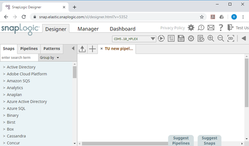
      </td>
    </tr>
    <tr>
      <td style="text-align:left">Tab / Sub-tab</td>
      <td style="text-align:left">
        
Tabs enable users to quickly move from one set of functionalities to another.
          The SnapLogic UI comprises three tabs: Designer, Manager, and Dashboard,
          and appear at the top-left of the SnapLogic UI.

        
Tabs that appear as part of the content inside a tab are called <b>sub-tabs</b>.

        
There may be situations where the UI in a sub-tab has tabs too. In such
          circumstances, we consider the &apos;context of a tab&apos; .and call it
          a tab in the context of the UI of the sub-tab.

        
For example, in the screenshot on the right, The <b>Health</b> sub-tab is
          part of the <b>Dashboard</b> tab, and there is a direct connection between
          Health and Dashboard, which is why (and how) the two are interconnected.

        
Similarly, the Resource History tab is connected to the Health sub-tab,
          and has no direct connection with the Dashboard tab. Thus, the Resource
          History tab functions as an independent tab under the Health sub-tab.

      </td>
      <td style="text-align:left">
        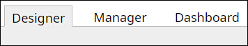
      </td>
    </tr>
    <tr>
      <td style="text-align:left"></td>
      <td style="text-align:left">
        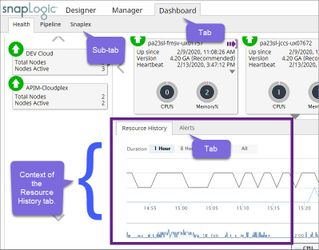
      </td>
      <td style="text-align:left"></td>
    </tr>
    <tr>
      <td style="text-align:left">Pane</td>
      <td style="text-align:left">
        
A bounded area within a page that groups together UI elements that serve
          a specific purpose.

        
Thus, we have the following hierarchy:

        <ul>
          <li>Window
            <ul>
              <li>Page (NOT screen)
                <ul>
                  <li>Tab
                    <ul>
                      <li>Pane (NOT fieldset)
                        <ul>
                          <li>Field (NOT property/parameter)</li>
                        </ul>
                      </li>
                    </ul>
                  </li>
                </ul>
              </li>
            </ul>
          </li>
        </ul>
        
Value

      </td>
      <td style="text-align:left">
        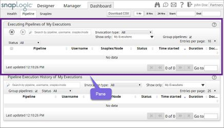
      </td>
    </tr>
    <tr>
      <td style="text-align:left">SnapLogic Toolbar</td>
      <td style="text-align:left">
        
This is the toolbar that is visible at the top-right section of the SnapLogic
          UI. This toolbar is common to all the tabs that comprise the SnapLogic
          UI.

        
The SnapLogic toolbar contains links (Privacy Policy), buttons (Settings,
          Notifications, and so on), and drop-down lists (The name of the Org).

      </td>
      <td style="text-align:left">
        
      </td>
    </tr>
    <tr>
      <td style="text-align:left">Designer Toolbar</td>
      <td style="text-align:left">
        
This toolbar contains drop-down lists and buttons that enable you to access
          key Designer functionality.

        
The Designer toolbar contains buttons (Save, Pipeline Properties, and
          so on), and drop-down lists (Snaplex name).

      </td>
      <td style="text-align:left">
        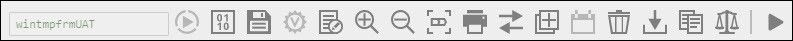
      </td>
    </tr>
    <tr>
      <td style="text-align:left">Asset Palette</td>
      <td style="text-align:left">
        
The Asset Palette contains all the assets that you need to create Pipelines.
          These are: <b>Snaps</b>, <b>Pipelines</b>, <b>Patterns</b>.

        <ul>
          <li>Clicking <b>Snaps</b> displays the Snap Catalog.</li>
          <li>Clicking <b>Pipelines</b> displays the Pipeline Catalog.</li>
          <li>Clicking <b>Patterns </b>displays the Pattern Catalog.</li>
        </ul>
      </td>
      <td style="text-align:left">
        
      </td>
    </tr>
    <tr>
      <td style="text-align:left">Snap Catalog</td>
      <td style="text-align:left">
        
The Snap Catalog enables users to search for and use Snaps.

        
The Snap Catalog contains a search field (enter search item), a drop-down
          list (Group by), and a list of Snaps, which the user can organize based
          on Snap Pack and type.

      </td>
      <td style="text-align:left">
        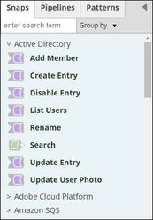
      </td>
    </tr>
    <tr>
      <td style="text-align:left">Pipeline Catalog</td>
      <td style="text-align:left">
        
The Pipeline Catalog displays all the Pipelines to which the user has
          access, organizing them into their parent Projects and Project Spaces.

        
The Pipeline Catalog contains a search field (enter search item), a drop-down
          list (Group by), and a list of Pipelines.

      </td>
      <td style="text-align:left">
        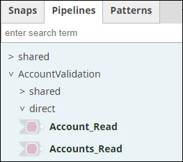
      </td>
    </tr>
    <tr>
      <td style="text-align:left">Pattern Catalog</td>
      <td style="text-align:left">
        
The Pattern Catalog displays all the Pattern Pipelines to which the user
          has access, organizing them into their parent Projects and Project Spaces.

        
The Pattern Catalog contains a search field (enter search item) and a
          list of Pattern Pipelines.

      </td>
      <td style="text-align:left">
        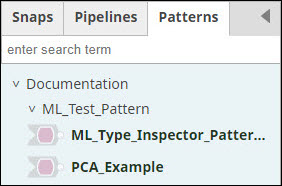
      </td>
    </tr>
    <tr>
      <td style="text-align:left">Designer Canvas</td>
      <td style="text-align:left">This is where users create Pipelines. This can also be simply called Canvas.</td>
      <td
      style="text-align:left">
        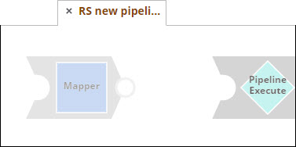
        </td>
    </tr>
    <tr>
      <td style="text-align:left">Suggest Pipelines
         AND
         Suggest Snaps Buttons</td>
      <td style="text-align:left">Use the Suggest Pipelines and Suggest Snaps buttons to respectively display
        the Suggested Pipelines and Suggested Snaps panes.</td>
      <td style="text-align:left">
        
      </td>
    </tr>
    <tr>
      <td style="text-align:left">Suggested Snaps AND Suggested Pipelines Pane</td>
      <td style="text-align:left">
        
<b>Suggested Snaps</b>
        

        
The Suggested Snaps pane appears at the bottom of the Canvas and displays
          upstream and downstream Snap suggestions based on the active Snap (or,
          the Snap selected.) Users click on a suggestion to add the concerned Snap
          to the Pipeline.

        
When the canvas is blank, Iris AI displays &quot;ghost&quot; start and
          end Snaps.

        
<b>Suggested Pipelines</b>
        

        
The Suggested Pipelines pane appears at the bottom of the Canvas and displays
          Pipeline suggestions based on the Snaps on the Canvas or the name of the
          Pipeline. Users click on a suggestion to add the concerned Pipeline to
          the Canvas.

      </td>
      <td style="text-align:left">
        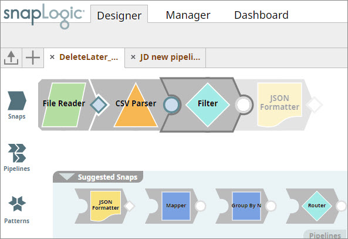
      </td>
    </tr>
    <tr>
      <td style="text-align:left">Snap</td>
      <td style="text-align:left">
        
A Snap is an object in the SnapLogic application that introspects the
          source and target and performs a single complete function, such as read,
          write, or act on data.

        
Snaps have an input view (on the left) and an output view (on the right.)

      </td>
      <td style="text-align:left">
        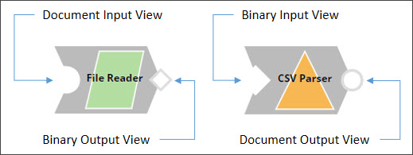
      </td>
    </tr>
    <tr>
      <td style="text-align:left">Pipeline</td>
      <td style="text-align:left">A chain of one or more Snaps linked together to orchestrate a data flow
        between endpoints.</td>
      <td style="text-align:left">
        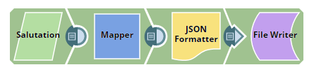
      </td>
    </tr>
    <tr>
      <td style="text-align:left">(Modal) Dialog Window</td>
      <td style="text-align:left">
        
A window that is dependent on the parent window, appearing as a result
          of an operation being performed on the parent window.

        
<b>What is &apos;modal&apos;?</b>
        

        
A modal window creates a mode that disables the main window but keeps
          it visible, with the modal window as a child window in front of it.

        
We go with &apos;dialog window&apos; because our target audience isn&apos;t
          used to &apos;modal&apos;.

      </td>
      <td style="text-align:left">
        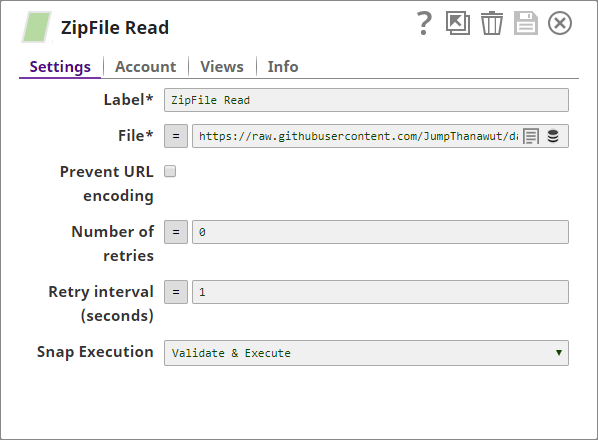
      </td>
    </tr>
    <tr>
      <td style="text-align:left">Text Field</td>
      <td style="text-align:left">A single-row box where users can add text. At times, text fields can also
        be <b>suggestible</b>, and users can view suggestions by either clicking
        a button or by simply typing text and selecting the suggestions displayed
        in response (See the second example.)</td>
      <td style="text-align:left">
        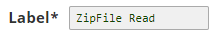
        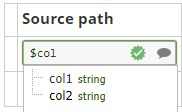
      </td>
    </tr>
    <tr>
      <td style="text-align:left">Search Field</td>
      <td style="text-align:left">A text field that you can use to run searches.</td>
      <td style="text-align:left">N/A</td>
    </tr>
    <tr>
      <td style="text-align:left">Button</td>
      <td style="text-align:left">
        
A small clickable UI element that triggers an action. Buttons typically
          have text with boundaries and background color.

        
<b>Difference between icons and buttons</b>
        

        
Icons can function as buttons; but buttons are not icons! Buttons are
          small clickable boxes with text on them; icons are graphics that indicate
          what they&apos;re about.

      </td>
      <td style="text-align:left">
        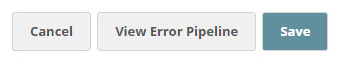
      </td>
    </tr>
    <tr>
      <td style="text-align:left">Check Box</td>
      <td style="text-align:left">A small UI box that users can select to indicate something, or deselect
        to indicate the opposite.</td>
      <td style="text-align:left">
        
      </td>
    </tr>
    <tr>
      <td style="text-align:left">Drop-down List</td>
      <td style="text-align:left">A field which, when clicked, displays a list of options. Users select
        one of the options listed to indicate something.</td>
      <td style="text-align:left">
        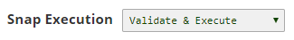
      </td>
    </tr>
    <tr>
      <td style="text-align:left">Text Box</td>
      <td style="text-align:left">A multi-row box where users can add running text.</td>
      <td style="text-align:left">
        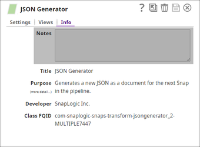
      </td>
    </tr>
    <tr>
      <td style="text-align:left">Option Buttons</td>
      <td style="text-align:left">Icons representing a set of options, of which only one can be selected
        at a time.</td>
      <td style="text-align:left">
        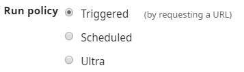
      </td>
    </tr>
    <tr>
      <td style="text-align:left">Date-Time Selector</td>
      <td style="text-align:left">A non-modal dialog (meaning that it does not stop you from interacting
        with the parent window) that appears when users either click on a date
        field or click the suggestion icon associated with it.</td>
      <td style="text-align:left">
        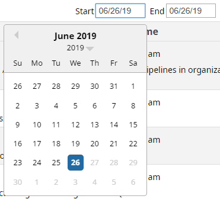
      </td>
    </tr>
    <tr>
      <td style="text-align:left">Pagination Links</td>
      <td style="text-align:left">These are links that enable users to access specific pages of data that
        spans multiple pages.</td>
      <td style="text-align:left">
        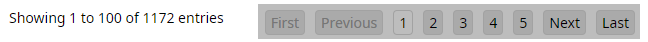
      </td>
    </tr>
    <tr>
      <td style="text-align:left">Tags</td>
      <td style="text-align:left">
        
UI elements displaying either as buttons or links that enable users to
          find content related to a specific topic or category.

        
While we do not use tags in SnapLogic, we do use them to categorize our
          documentation in Confluence.

      </td>
      <td style="text-align:left">
        
      </td>
    </tr>
    <tr>
      <td style="text-align:left">Icon</td>
      <td style="text-align:left">
        
A graphic representing a specific action or facility. Some of these can
          be links.

        
<b>Difference between icons and buttons</b>
        

        
Icons can function as buttons; but buttons are not icons! Buttons are
          small clickable boxes with text on them; icons are graphics that indicate
          what they&apos;re about.

      </td>
      <td style="text-align:left">
        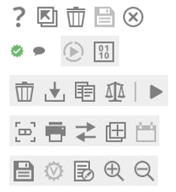
        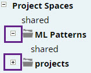
        
      </td>
    </tr>
    <tr>
      <td style="text-align:left">Tooltip</td>
      <td style="text-align:left">
        
Enables a user to see information related to a specific field in the UI.
          SnapLogic uses tooltips extensively to provide embedded help to users.

        
A tooltip also appears when you mouse over a graph item.

      </td>
      <td style="text-align:left">
        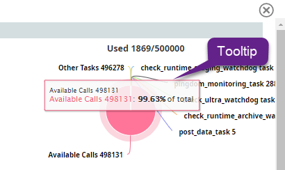
        
      </td>
    </tr>
    <tr>
      <td style="text-align:left">Context Menu</td>
      <td style="text-align:left">A context menu is a menu in a graphical user interface that appears upon
        user interaction, such as a right-click mouse operation or a mouseover.
        A context menu offers a limited set of choices that are available in the
        current state, or context, of the operating system or application to which
        the menu belongs.</td>
      <td style="text-align:left">
        
      </td>
    </tr>
    <tr>
      <td style="text-align:left">Error Messages</td>
      <td style="text-align:left">Messages that appear in the UI if the application is unable to perform
        the operations requested by a user. Error messages contain three elements:
        Error, Reason, and Resolution. See <a href="file:///C:/wiki/pages/resumedraft.action%3fdraftId=585596949#SnapLogicDocumentationStyleGuideSingle-Pager-SEM">Standards for Error Messages</a>.</td>
      <td
      style="text-align:left">
        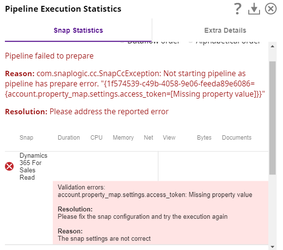
        </td>
    </tr>
    <tr>
      <td style="text-align:left">Slider</td>
      <td style="text-align:left">A UI control that is moved horizontally or vertically to control a variable.</td>
      <td
      style="text-align:left">
        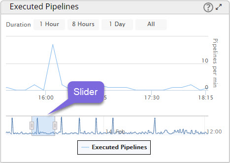
        </td>
    </tr>
    <tr>
      <td style="text-align:left">Value</td>
      <td style="text-align:left">
        
Value has two acceptable meanings:

        <ul>
          <li>Item in an LOV (list of values in a drop-down list)</li>
          <li>Value associated with a key in a parameter.</li>
        </ul>
      </td>
      <td style="text-align:left">
        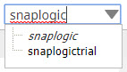
        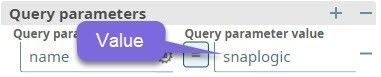
      </td>
    </tr>
    <tr>
      <td style="text-align:left">Key</td>
      <td style="text-align:left">The name of a parameter in a query.</td>
      <td style="text-align:left">N/A</td>
    </tr>
  </tbody>
</table>

### Sample Data and Example Names

#### Sample data

Use sample data from the [Sample Data](file:///C:/wiki/spaces/DT/pages/886374432/Sample+Data) page in sample Pipelines. If you come across additional sample data, feel free to upload them on to the Sample Data page. Tag Ankur once you are done.

#### Example Names

Use the following example names in your Pipelines and examples.

<table>
  <thead>
    <tr>
      <th style="text-align:left"><b>Name</b>
      </th>
      <th style="text-align:left"><b>Description</b>
      </th>
    </tr>
  </thead>
  <tbody>
    <tr>
      <td style="text-align:left">
        
John Doe

        
Winston Smith

        
Jane Doe

        
Karen Smith

      </td>
      <td style="text-align:left">Example user names</td>
    </tr>
    <tr>
      <td style="text-align:left">Sample Company Inc.</td>
      <td style="text-align:left">Example company name.</td>
    </tr>
  </tbody>
</table>

#### Documentation page titles

Use title case for your headings unless the title is a sentence. See [Capitalizing Headings](file:///C:/wiki/pages/resumedraft.action%3fdraftId=585596949#SnapLogicDocumentationStyleGuideSingle-Pager-CapitalizingHeadings) for more information.

**Special characters in page names**

It's best to minimize the use of special characters in titles, to ensure consistency. Avoid all special characters in titles as far as possible. However, if the name of the Snap contains parentheses, you must include it in the title.

**Examples**

* Vertica - Multi Execute \(Beta\)

### Table of Contents

Create TOCs for each page with the following settings:

* Maximum Heading Level = 2.
* Select **Printable** to ensure that when users print the document, the TOC is printed.
* Select the **Absolute URL** check box to ensure that the links in the table of contents are full URLs. This will enable us to create links to precise sections of the document if required.

If you have important content that is at a lower level, and you want to include it in your table of contents, you may need to change the Maximum Heading Level to a greater number.

#### Check for and remove non-TOC content in the TOC

By mistake, sometimes some content text may be marked out as a heading. In which case, this content could show up in the TOC. Edit the ToC macro and refresh the Preview to see this.

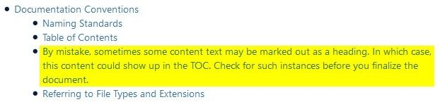

### Working with Excerpts

* Use excerpts to capture information that must be repeated elsewhere in the docs.
* Whenever you see excerpts in a live doc, do not delete it. If there is an excerpt, there has to be at least one excerpt include; and if you delete the excerpt, the content in the excerpt include becomes blank.
* Use the [Excerpt Sources Page](https://mysnaplogic.atlassian.net/wiki/spaces/DT/pages/1160937557/Excerpt+Sources+in+Live+Docs) to view and update excerpt usage in our docs.

### Working with Screenshots

#### When to use screenshots

Use screenshots only when they contain information that either provides the user some direct insight or helps the user perform specific tasks.

Avoid adding screenshots that do nothing more than show the user what a specific screen looks like.

#### Field values in screenshots

Ensure that at least all the mandatory fields are filled in your screenshots. Use sample/generic values, but ensure that the text in your fields are indicative of actual content.

#### Working with WEBP files

Some legacy screenshots in Confluence are saved as WEBP files. These do not open in most image viewers, such as Windows Photos or Irfanview.

When you encounter a WEBP file in a LiveDocs page:

1. Try clicking on it to view it. Often this does not work; Confluence says "We can't load the image"; and the link below appears to point to a PDF file.
2. If you are able to view it, download the file and try creating a new image using the contents of the downloaded file; or take a new screenshot.
3. If you're unable to view it, edit the page, add and open an attachments macro and, from the list of files displayed, right-click the WEBP file and do a File Save As. Use the saved file to create a new image. Use a generic image viewer like Irfanview. This tool works with most image formats.
4. If the image doesn't open with Irfanview, you must download [GIMP](https://www.gimp.org/downloads/). That tool can also help you manipulate the file to suit your needs and output a more suitable format using the same file.

#### Capturing screenshots

Use Snagit to take screenshots. For detailed information on how to use Snagit, see [Camtasia Documentation](https://support.techsmith.com/hc/en-us).

#### Creating screenshots

* Ensure that the pointer does not show up in the your screenshots.
* Crop empty real estate in your screenshots before you place them into your documentation.
* Keep your screenshot size to under 1000px. 
* Use the Highlighter tool freely, so users know what to look for. Do NOT use the Shapes &gt; Rectangle tool!
* Use the Blur tool to obfuscate proprietary and private information.

**Example**

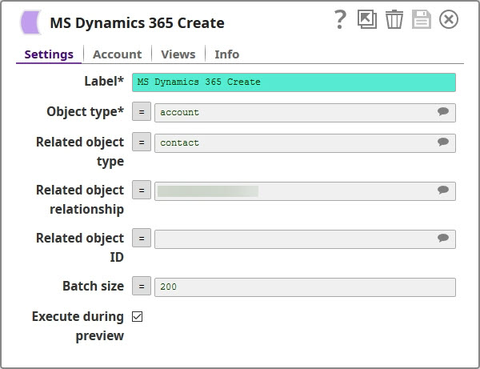

Ensure that your screenshots display at the same level as the content of which it forms a part. For example, if your screenshot is part of a numbered list, the screenshot must appear as part of the numbered list, so that the content below it can resume the numbered list.

**Example**:

Creating an MS Dynamics 365 for Sales Object

#### Creating an MS Dynamics 365 for Sales Object

To create an MS Dynamics 365 for Sales object:

1. Click and drag the **Dynamics 365 for Sales - Create** Snap on to the canvas.
2. Click on the Snap to display the MS Dynamics 365 Create Settings dialog.

   

3. Enter/select the **Object type** of the object you want to create.
4. ...

#### Screenshot naming standards

**Why is this important?**

If screenshots are named indicatively, it simplifies the task of figuring out where they are used in the documentation. If you are asked to update a document created by someone else, it becomes difficult to manage randomly-named screenshots. Even if you created the documentation yourself, you may forget which screenshot went where; and if the screenshot names aren't indicative of what they illustrate, you may face the same problem that anyone else may face while updating your documentation.

**Key screenshot naming standards**

This section lists out the naming standards to be followed while creating and saving screenshots:

1. Separate nomenclature components by '\_'.
2. Do not list the version number. Customers can view the image separately, and the entire name is displayed. The version associated with the screenshot is indicative of the age of the screenshot; and this is not something we want to share with customers.

Here's what the customer can see...

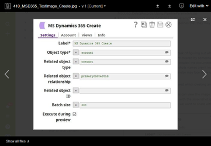

1. Enter the abbreviated Snap Pack name. Example: MSD365, WD, FR, and so on. For a list of abbreviated Snap Pack names, see Abbreviated Snap Pack Names \(Link to a Google Sheet\).
2. Enter the name of the Snap associated with the screenshot. **Examples**:
   1. WD\_Read
   2. MSD365\_Search.
3. Enter the name of the section under which the screenshot must appear. Use portmanteaux if required, capitalizing the initial letter of each word in each portmanteau. **Examples**:
   1. WDR\_Read\_Settings
   2. MSD365\_Search\_Exmpl\_SearchDelete
4. Enter the screenshot number. Label the first screenshot in the section as '\_01', second as '\_02', and so on. **Examples**:
   1. WDR\_Read\_Settings\_01.png
   2. MSD365\_Search\_Exmpl\_SearchDelete\_03.jpg

### Documenting Buttons and Icons

If you must use the word 'button' or 'icon', do so only when:

* There is at least one other UI element with the same name.
* The button/icon is in a location where it can easily be missed.

As a general rule, avoid documenting something that should be obvious to your target audience.

**Examples**

| **Not recommended** | **Recommended** |
| :--- | :--- |
| Click the **Okay** button. | Click **Okay**. |
| Click **Edit**. \(When the Edit button is at the top-right corner of the page.\) | Click the **Edit** icon at the upper-right corner of the page. \(Using the icon image may not be a bad idea here!\) |
| Click the  icon to expand the pane. | Click 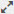 to expand the pane. |

### Documenting Snap Properties

#### None.

In situations where "None" appears alone, it functions as a complete, independent sentence, and must start with a capital letter and end with a period.

**Example:**

Prerequisites: None.

#### Documenting default values

If a field has a default value, enter it directly as follows:

Default Value: 12

Note that there is no period at the end of the default value.

If a field has no default value, document this as follows:

Default Value: N/A.

### Documenting Snap Input and Output

Document the 'Expected input' and 'Expected output' sections as precisely as possible.

For the 'Expected upstream Snaps' and 'Expected downstream Snaps', use one of the following as appropriate:

For a Document-Document Snap

* **Expected upstream Snap**: Optional. \(If required.\) A Snap that offers documents. For example: &lt;Add Snap examples here&gt;.
* **Expected downstream Snap**: Optional. \(If required.\) A Snap that accepts documents. For example: &lt;Add Snap examples here&gt;.

For a Document-Binary Snap

* **Expected upstream Snap**: Optional. \(If required.\) A Snap that offers documents. For example: &lt;Add Snap examples here&gt;.
* **Expected downstream Snap**: Optional. \(If required.\) A Snap that accepts binary data. For example: &lt;Add Snap examples here&gt;.

For a Binary-Document Snap

* **Expected upstream Snap**: Optional. \(If required.\) A Snap that offers binary data. For example: &lt;Add Snap examples here&gt;.
* **Expected downstream Snap**: Optional. \(If required.\) A Snap that accepts documents. For example: &lt;Add Snap examples here&gt;.

For a Binary-Binary Snap

* **Expected upstream Snap**: Optional. \(If required.\) A Snap that offers binary data. For example: &lt;Add Snap examples here&gt;.
* **Expected downstream Snap**: Optional. \(If required.\) A Snap that accepts binary data. For example: &lt;Add Snap examples here&gt;.

### Documenting Snap Settings

Follow the guidance provided in the Snap Documentation Template.

### Documenting Procedures

* Introduce an extra line &lt;Shift+Enter&gt; only after every step.
* Do not add extra lines before screenshots associated with a step.

### Examples and Use Cases in Documentation

#### Difference between an example and a use case

In our documentation:

* An example is a simple Pipeline that demonstrates how specific features of a Snap can be used.
* A use case is a complex Pipeline that demonstrates how Snaps from a specific Snap Pack can be used to solve real-life problems.

#### Examples

Include as many examples as needed to showcase a feature's abilities and–more importantly–quirks.

* Create examples under the Examples section \(H1\) of the concerned Snap's documentation. Title each example using an H2.
* Summarize each example in the first paragraph, with a screenshot of the final Pipeline.
* Use screenshots to help users understand the configuration–and output if required–of each Snap in the example.
* Provide downloadable Pipelines, so users can follow the documentation "live" and play with the Pipeline and see how the output changes. Use the Attachments macro to display all the Pipelines uploaded to the document.
* Always use the second person in examples documentation.

**Examples**

* [https://docs-snaplogic.atlassian.net/wiki/spaces/SD/pages/542572775/MS+Dynamics+365+for+Sales+Delete+-+Alpha+Version](https://docs-snaplogic.atlassian.net/wiki/spaces/SD/pages/542572775/MS+Dynamics+365+for+Sales+Delete+-+Alpha+Version)
* [https://docs-snaplogic.atlassian.net/wiki/spaces/SD/pages/1438906/Workday+Read](https://docs-snaplogic.atlassian.net/wiki/spaces/SD/pages/1438906/Workday+Read)

#### Use Cases

Create use cases to reflect real-life scenarios.

* Create use cases as independent documents under the Snap Pack documentation page.
* While you can structure use cases to suit your topic, include at least the following sections to ensure that both functional and technical users can understand the use case:
  * Overview: Provide a high-level \(functional\) description of the use case.
  * Use Case Structure / Process Summary: Break the functional overview into key steps, ideally mapped to a specific Pipeline.
  * Pipelines Used: Describe what each Pipeline does from a functional perspective. 
  * Pipeline Details: Detail how each Pipeline works. Be as technical as advised by the SME.
  * _**I feel we should have a conclusion section as well. Need some pointers here on what this section can contain.**_

**Examples**

* [Building a Sentiment Analysis Model Using SnapLogic Data Science](https://docs-snaplogic.atlassian.net/wiki/spaces/SD/pages/721354985/Building+a+Sentiment+Analysis+Model+Using+SnapLogic+Data+Science)

#### Prefacing and formatting examples in text

Preface examples in text using one of the following patterns:

**As part of running text**

**Separated by a semi-colon**

* Preface your examples with "for example".
* If you intend to offer only up to two examples, use a comma after the prefacing phrase and include examples in the same sentence. Do not use 'and' between the examples; use a comma. \(See the first example below.\)
* If you intend to offer more than three examples, use a colon after the prefacing phrase. Do not use 'and' between the examples; use a comma. \(See the second example below.\)
* You can include examples in the same paragraph if you wish; but if your examples are long strings or contain explanations/notes, list your examples out. \(See the third example below.\)

**Examples**

1. List out file extensions in upper case; for example, HTML, XML.
2. List out file extensions in upper case; for example: HTML, XML, JSON.
3. Use glob patterns in this filter to select one or more files in the directory; for example:
   * \*.java Matches file names ending in .java.
   * \*.\* Matches file names containing a dot.
   * \*.{java,class} Matches file names ending with .java or .class.
   * foo.? Matches file names starting with foo. and a single character extension.

**As part of Snap settings**

Do not bold the "Example:" label.

Similarly, do not bold the "Default value:" label.

**Examples**

| **Not recommended** | **Recommended** |
| :--- | :--- |
| **Example**: test.csv | Example: test.csv |
| **Default value**: None. | [D](https://web.archive.org/web/20151016053704/http://wam.inrialpes.fr/courses/PG-MoSIG12/xml.pdf)efault value: N/A |

### Links in Your Documentation

#### Links to related information

Provide cross-links to information related to the content. For example, consider adding cross-links to the following information, if available:

* How to create specific accounts
* How to configure specific settings
* Limitations to functionality, if documented elsewhere
* Best practices
* Dependencies, if documented elsewhere

Ensure that you provide the links in context, so there's no ambiguity in terms of where the link goes and why it is placed.

#### Links to external information

* External links should always be for official documentation. Avoid Stackoverflow, Wikipedia, or any such forum-based sites.
* You can also add links to relevant external pages in the See Also section at the end of the doc page.

**Examples**

* The Blowfish Decrypt Snap uses account references created on the [/wiki/spaces/SPD/pages/60756425](file:///C:/wiki/spaces/SPD/pages/60756425) page of the SnapLogic Manager to handle access to this endpoint. This Snap supports a Symmetric crypto account, or no account. See [Binary Accounts](https://mysnaplogic.atlassian.net/wiki/spaces/SPD/pages/59602456/Binary+Accounts) for information on setting up this type of account.
* Overview of the Adobe I/O Console Authentication: [https://www.adobe.io/apis/cloudplatform/console/authentication/gettingstarted.html](https://www.adobe.io/apis/cloudplatform/console/authentication/gettingstarted.html)

The best way to avoid future availability issues is perhaps to provide the link to the top-level page of public-facing third-party official docs. These are not likely to change, and will be maintained even after the application/technology is no longer supported.

**Examples**

### Referring to File Types and Extensions

In general, refer to file types in UPPERCASE \(JAR, HTML, ZIP\), and keep the dot-notation when referring to actual file names or data to enter \(install.jar, include the extension .zip to specifying the ZIP file to include\)

### Acronyms and Abbreviations

#### What are acronyms?

Acronyms are abbreviations formed from the initial letters of each successive word or major parts of a compound term or of selected letters of a word or phrase.

* Writing acronyms
  * Always write acronyms in uppercase, unless the acronym has become a common word, such as laser or sonar. For example, XML, HTML.
  * Do NOT use periods within–or at the end of–acronyms \(unless they come at the end of a sentence.\)
* Forming words using acronyms: If you are using affixes with acronyms, the acronym itself remains in upper case while the affix can be entered in lower case. For example, RESTful.
* Acronym plurals: Avoid pluralizing acronyms as far as possible. If you have to use the plural form of acronyms, treat acronyms as you would treat any other word. Do NOT use apostrophes while pluralizing acronyms. For example: IDEs, APIs \(not \*API's\)

#### What are abbreviations?

An abbreviation is a shortened form of a word or phrase. It consists of a group of letters taken from the word or phrase.

Source: [Wikipedia](https://en.wikipedia.org/wiki/Abbreviation)

Always use a period after abbreviations. 

Exception: Omit the period if the abbreviation is now in common usage as a word in its own right.

**Examples**

* a.m., p.m.
* lbs., mm. BUT
* comms

## Page Structure and Hierarchy

### Heading 1

* Use Heading 1 for all top-level headings
* Use Title Case.

**Examples**

* Overview
* Settings
* Examples
* Related Information
* How to delete a Pipeline
* What is a refresh interval?

### Heading 2

* Use Heading 2 to label all content that belongs directly under a section with a Heading 1 heading.
* Use Title Case unless the heading is a sentence.

**Examples**

* Overview &gt; Input and Output
* Examples &gt; Example 1
* Related Information &gt; Related Links
* Related Information &gt; Downloads
* Snaplexes &gt; What is a Snaplex?

### Heading 3 and Below

* Use Heading 3 to label all content that belongs directly under a section with a Heading 2 heading. Similarly, use Heading &lt;N&gt; to label all content that belongs directly under a section with a Heading &lt;N-1&gt; heading.
* Use sentence case.

## Formatting Guidelines

### Capitalization Conventions

#### Capitalize the following

<table>
  <thead>
    <tr>
      <th style="text-align:left"><b>SnapLogic Company and Product Names</b>
      </th>
      <th style="text-align:left">
        <ul>
          <li>Pipeline</li>
          <li>Task (including Ultra Task, Scheduled Task, Triggered Task)</li>
          <li>Snap</li>
          <li>Scheduled Tasks</li>
          <li>Ultra Tasks</li>
        </ul>
      </th>
      <th style="text-align:left">See the <a href="file:///C:/wiki/spaces/Marketing/pages/757563495">/wiki/spaces/Marketing/pages/757563495</a> for
        the detailed list of company and product names.</th>
    </tr>
  </thead>
  <tbody>
    <tr>
      <td style="text-align:left"><b>Proper Nouns</b>
      </td>
      <td style="text-align:left">
        <ul>
          <li>Snap</li>
          <li>Ajax</li>
        </ul>
      </td>
      <td style="text-align:left"></td>
    </tr>
    <tr>
      <td style="text-align:left"><b>Brand &amp; Organization Names</b>
      </td>
      <td style="text-align:left">
        <ul>
          <li>SnapLogic</li>
          <li>Confluence</li>
        </ul>
      </td>
      <td style="text-align:left"></td>
    </tr>
    <tr>
      <td style="text-align:left"><b>Acronyms</b>
      </td>
      <td style="text-align:left">
        <ul>
          <li>HTML</li>
          <li>USA</li>
        </ul>
      </td>
      <td style="text-align:left">See Also <a href="file:///C:/wiki/pages/createpage.action%3fspaceKey=DT&amp;title=Acronyms%20and%20Abbreviations&amp;linkCreation=true&amp;fromPageId=585596949">Acronyms and Abbreviations</a>
      </td>
    </tr>
    <tr>
      <td style="text-align:left"><b>Days of the Week &amp; Months of the Year</b>
      </td>
      <td style="text-align:left">
        <ul>
          <li>Monday</li>
          <li>Tuesday</li>
          <li>January</li>
          <li>February</li>
        </ul>
      </td>
      <td style="text-align:left"></td>
    </tr>
  </tbody>
</table>

#### Capitalizing UI element names

Do NOT use title case while referring to a UI element; enter the UI element name precisely as shown in the application.

#### Capitalizing headings

* Use title case for all H1 and H2 headings \(topic titles and internal headings\) unless the heading is a sentence.
* Use sentence case for all headings below H2.

**Examples**

* Capitalizing Headings \(H1\)
* Scheduling Tasks
* Scheduling tasks \(H3 onwards\)

  BUT \(Regardless of the heading level.\)

* When to capitalize headings?
* Scheduling a task
* How can I schedule a task?
* How to assign permissions to a project?

**While Using title case in headings**

Capitalize the following:

* Nouns
* Pronouns
* Adjectives
* Verbs
* Adverbs

Capitalize all heading words that are at least five letters long. This includes all the words listed in the Do NOT Capitalize section below!

**Examples**

* Single Sign-On Through SAML
* Data Preview from a Pipeline

Do NOT capitalize the following words in headings unless they start the heading OR are critical to the title:

* Articles: a, an, the
* Prepositions: in, on, with
* Conjunctions: and, but, or

Obviously, the word 'I' is always capitalized. :-\)

### Headings

#### Heading use

Use Heading 1 as the top-level heading in your document; all subtopics related to the top-level heading to come under it. Create a new top-level heading only if the new content is not related to the previous section.

**Example**

Click here to expand...

**Title: SnapLogic Documentation Style Guide**

\(I'm using numbers here just to simplify the illustration:\)

1. Documentation Conventions

    1.1 Avoid the Following

    1.2 Documentation Dos

          1.2.1 Referring to file types and extensions

          1.2.2 Documenting buttons and icons

                  1.2.2.1 Documenting buttons

                  1.1.2.2 Documenting icons

          1.2.3 Variables

    1.3 SnapLogic Terminology

    1.4 Spacing

2. Formatting Guidelines

    2.1 Formatting Code  
          2.1.1 Code functions  
          2.1.2 Formatting key words of code inline  
          2.1.3 Code snippets  
    2.2 Menu Paths  
    2.3 Formatting Pipelines

3. Punctuation Guidelines

4. Stylistic Guidelines

#### Single-Line Headings

* Ensure that your heading fits into a single line. Rephrase if necessary.
* Generally, keep your headings as short as possible.

**Related information**

* [Capitalizing Headings](file:///C:/wiki/pages/createpage.action%3fspaceKey=DT&title=Capitalization&linkCreation=true&fromPageId=585596949)

#### Formatting in headings

* Do NOT add formatting to headings: Avoid Italicized and bold text as far as possible. 
* Just choose the required format and leave it at that.

**Example**

| **Not recommended** | **Recommended** |
| :--- | :--- |
| Specifying Address Details Using **Contact Manager** | Specifying Address Details Using Contact Manager |

#### Special characters in headings

Do not use special characters \(such as & for and\) in headings or titles of pages. 

#### Colons in headings

Avoid ending headings with a colon. If you must, ensure that the heading and the following content are in the same line.

**Examples**

<table>
  <thead>
    <tr>
      <th style="text-align:left"><b>Not recommended</b>
      </th>
      <th style="text-align:left"><b>Recommended</b>
      </th>
    </tr>
  </thead>
  <tbody>
    <tr>
      <td style="text-align:left">
        
<b>Examples:</b>
        

        <ul>
          <li>Click the <b>Settings</b> tab to view and manage Snap settings.</li>
          <li>Enter your email ID in the <b>Username</b> field.</li>
        </ul>
      </td>
      <td style="text-align:left">
        
<b>Examples</b>
        

        <ul>
          <li>Click the <b>Settings</b> tab to view and manage Snap settings.</li>
          <li>Enter your email ID in the <b>Username</b> field.</li>
        </ul>
      </td>
    </tr>
    <tr>
      <td style="text-align:left"><b>Examples</b>: HTML, XML, CSV, JSON</td>
      <td style="text-align:left">Examples: HTML, XML, CSV, JSON</td>
    </tr>
  </tbody>
</table>

### Bold Font Usage

Use **bold** to highlight all–and only–UI elements.

**Examples**

* Click the **Settings** tab to view and manage Snap settings.
* Enter your email ID in the **Username** field.
* Select the **Keep Me Informed** check box to enable notifications.
* The **Notes** text box in the **Info** tab enables you to enter comments related to the Snap's role in the Pipeline.
* Use the **Version ID** field to specify the version of the file listed in the **File** field that you want to read.

Use **bold** to set off headings that are not part of the core structure of the document, or which are lower than Heading 6. Confluence doesn't have paragraph options beyond Heading 6. Generally, avoid going beyond heading 4 in a page. If needed, reorganize the information into multiple sections or documents.

**Example**

* Table headings
* Headings of list items

  **Example**

  * First Name: Displays your first name.

Do NOT use bold to highlight something. Avoid highlights completely if possible. If you must, use _italics_.

### Italics Font Usage

* Use italics to highlight user-entered values. 
* Use italics to highlight values in fields.
* Avoid italics in documentation.

**Examples**

<table>
  <thead>
    <tr>
      <th style="text-align:left"><b>Not recommended</b>
      </th>
      <th style="text-align:left"><b>Recommended</b>
      </th>
    </tr>
  </thead>
  <tbody>
    <tr>
      <td style="text-align:left">
        
Enter <b>/QA/projects/shared</b> in the <b>Directory</b> field.

        
Select the <b>LZO</b> option in the <b>Compression</b> field.

      </td>
      <td style="text-align:left">
        
Enter /QA/projects/shared in the <b>Directory</b> field.

        
Select the LZO option in the <b>Compression</b> field.

      </td>
    </tr>
  </tbody>
</table>

### Formatting Code

#### Code functions

Show code functions in simple capital letters.

**Examples**

* COUNT
* SELECT

To display specific words of quote inline, select the **More &gt; Monospace** option from the formatting options available, like so:

#### Code snippets

* Use the Better Code Block macro to document code snippets.
* Ensure that every code snippet has a title and a high-level description.
* Use code macros only when you are displaying information that customers would typically see; avoid code snippets visible to developers internally.
* As far as possible, use code snippets sparingly. Use screenshots of Snap outputs instead of the actual JSON content.
* If the first line of code in the code snippet is longer than half the screen, add a space and a line-break \(br, or shift+&lt;Enter&gt;\) in the beginning of the code. This ensures that when the window is resized, the **Copy to clipboard** doesn't slide over the code content.

**Example**

#### Information boxes

Use information boxes to give background about a specific option/parameter/functionality that requires the user to make a smart decision when using said functionality. Do not use information boxes to describe functionality or how to use it–that should be part of the mainline procedure.

### Formatting Variables

* To indicate a variable value, enclose a term with angular brackets.
* Replace all spaces in the content within angular brackets with underscores \(\_\). Unless the variable actually uses spaces.
* Follow the casing to be used in the original variable, if you plan on updating the UI strings; else, use the string in the UI.

**Examples**

| **Not recommended** | **Recommended** |
| :--- | :--- |
| \[filename\] | &lt;filename&gt; |
| s3:///&lt;S3 bucket name&gt;/&lt;file path&gt; | s3:///&lt;S3\_Bucket\_Name&gt;/&lt;file\_path&gt; |

### Menu Paths

Format all UI elements \(page and dialog names, menu paths, buttons, fields, and so on\) in **bold.**

**Examples**

| **Not recommended** | **Recommended** |
| :--- | :--- |
| Once you have logged into SnapLogic, navigate to Manager &gt; Activity Log. | Once you have logged into SnapLogic, navigate to **Manager &gt; Activity Log**. |
| The Designer &gt; Settings dialog enables you to manage auto-validation, dynamic validation, and Integration Assistant settings. | The **Designer &gt; Settings** dialog enables you to manage auto-validation, dynamic validation, and Integration Assistant settings. |
| To enable snap execution during validation, click the concerned Snap to view its details. In the dialog that appears, select the Settings &gt; Execute during preview check box. | To enable snap execution during validation, click the concerned Snap to view its details. In the dialog that appears, select the **Settings &gt; Execute during preview** check box. |

### Formatting Pipelines

Format a written Pipeline as a list of Snaps separated with a +.

**Example**

* CSV-to-JSON Convertor Pipeline: File Reader + CSV Parser + Sort + JSON Formatter + File Writer

### Notes

* Use Note macros for notes. Add a heading to the macro, so users know what the note is about.
* Avoid creating multiple notes in succession. Club them together into a bulleted list of notes.
* Do not add a heading for Note macros that have multiple bullet points.

### Formatting User-entered Values

* Italicize user-entered values, including drop-down menu selections.
* Use Monospace for URLs and directories.

**Examples**

| **Not recommended** | **Recommended** |
| :--- | :--- |
| Enter "\*.csv" in the **Search string** field. | Enter \*.csv in the **Search string** field. |
| Click the **Address type** field in the Address pane, and select **Billing Address** from the drop-down list displayed. | Click the **Address type** field in the Address pane, and select Billing Address _****_from the drop-down list displayed. |

## Punctuation Guidelines

### Commas

#### Serial commas

* Use a comma to separate each item in a sequence, and before the conjunction at the end.
* If your sequence has more than three items, consider using a bulleted list.
* Do not use Latin phrases, such as i.e., e.g., and etc. See [Acronyms and Abbreviations](https://mysnaplogic.atlassian.net/wiki/spaces/DT/pages/585596949/SnapLogic+Style+Guide+Single-Pager#SnapLogicStyleGuideSingle-Pager-AcronymsandAbbreviations) for more information.

**Examples**

| **Not recommended** | **Recommended** |
| :--- | :--- |
| You must have a Workday Account, data to query and Workday security access to the objects concerned. | You must have a Workday Account, data to query, and Workday security access to the objects concerned. |
| Full access permissions allow the user to read, write and execute commands within the project.  | Full access permissions allow the user to read, write, and execute commands within the project.  |

#### Adverbial qualifications/modifiers

What is an adverbial qualification?

An adverbial qualification is a word, phrase, or clause that functions as \(does the work of\) an adverb.

**Examples**

* You can, optionally, specify output fields to filter the data that you want to see. \(Adverb\)
* On receiving the server’s response, the Snap converts the returned SOAP XML into JSON for the output view. \(Adverb phrases\)
* You must save your changes before you exit the screen. \(Adverb clause\)

The default position of adverbial qualifications is after the the word they modify. In some cases, especially if an adverb is used, their default position may be before the word they modify. Depending on the context, adverbial qualifications may be moved around in a sentence without impacting the output.

Use commas on both sides of adverbial qualifications if they are not used in their default positions.

**Examples**

<table>
  <thead>
    <tr>
      <th style="text-align:left"><b>Scenario</b>
      </th>
      <th style="text-align:left"><b>Recommended</b>
      </th>
    </tr>
  </thead>
  <tbody>
    <tr>
      <td style="text-align:left">Adverbial qualifications removed from their default location</td>
      <td style="text-align:left">
        <ul>
          <li>Default position: The Snap converts the returned SOAP XML into JSON on
            receiving the server&apos;s response.</li>
          <li>Removed from the default position: The Snap, on receiving the server&apos;s
            response, converts the returned SOAP XML into JSON.</li>
        </ul>
      </td>
    </tr>
    <tr>
      <td style="text-align:left">Four possible locations for the same adverbial qualification</td>
      <td style="text-align:left">
        <ul>
          <li>When moved to the Pipeline canvas, Snaps may display with an input and/or
            output.</li>
          <li>Snaps, when moved to the Pipeline canvas, may display with an input and/or
            output.</li>
          <li>Snaps may, when moved to the Pipeline canvas, display with an input and/or
            output.</li>
          <li>Default (No commas): Snaps may display with an input and/or output when
            moved to the Pipeline canvas.</li>
        </ul>
      </td>
    </tr>
    <tr>
      <td style="text-align:left">In the beginning of a sentence:</td>
      <td style="text-align:left">
        <ul>
          <li>Click the <b>Details</b> button for additional node information.</li>
          <li>For additional information, click the <b>Details</b> button.</li>
        </ul>
      </td>
    </tr>
  </tbody>
</table>

As far as possible, if you plan to use adverbial qualifications in their non-default locations, consider using them as introductory phrases, especially so when there is a cause-effect involved.

**Examples**

<table>
  <thead>
    <tr>
      <th style="text-align:left"><b>Not recommended</b>
      </th>
      <th style="text-align:left"><b>Recommended</b>
      </th>
    </tr>
  </thead>
  <tbody>
    <tr>
      <td style="text-align:left">
        <ul>
          <li>The Snap, once it is enabled, is automatically validated.</li>
          <li>The Snap Statistics, in the meantime, display the tasks being performed
            during validation.</li>
        </ul>
      </td>
      <td style="text-align:left">
        
Once it is enabled, the Snap is automatically validated.

        
In the meantime, the Snap Statistics display the tasks being performed
          during validation.

      </td>
    </tr>
  </tbody>
</table>

**Introductory phrases**

When adverbial qualifications start a sentence, they are called introductory phrases.

Use a comma to separate introductory phrases from the rest of the sentence.

**Example**

<table>
  <thead>
    <tr>
      <th style="text-align:left"><b>Not recommended</b>
      </th>
      <th style="text-align:left"><b>Recommended</b>
      </th>
    </tr>
  </thead>
  <tbody>
    <tr>
      <td style="text-align:left">
        <ul>
          <li>If used without arguments the API method returns information about all
            the nodes in the organization.</li>
          <li>When moved to the Pipeline canvas Snaps may display with an input and/or
            output.</li>
        </ul>
      </td>
      <td style="text-align:left">
        
If used without arguments, the API method returns information about all
          the nodes in the organization.

        <ul>
          <li>When moved to the Pipeline canvas, Snaps may display with an input and/or
            output.</li>
        </ul>
      </td>
    </tr>
  </tbody>
</table>

#### With conjunctions

Use a comma to separate independent clauses joined by a conjunction.

**Examples**

<table>
  <thead>
    <tr>
      <th style="text-align:left"><b>Not recommended</b>
      </th>
      <th style="text-align:left"><b>Recommended</b>
      </th>
    </tr>
  </thead>
  <tbody>
    <tr>
      <td style="text-align:left">
        <ul>
          <li>Alerts track Snaplex congestion and you can configure them to display
            the precise information you need.</li>
          <li>Click the <b>Snap Statistics</b> link and the application displays statistics
            related to the concerned Snap.</li>
        </ul>
      </td>
      <td style="text-align:left">
        <ul>
          <li>Alerts track Snaplex congestion, and you can configure them to display
            the precise information you need.</li>
          <li>Click the <b>Snap Statistics</b> link, and the application displays statistics
            related to the concerned Snap.</li>
        </ul>
      </td>
    </tr>
    <tr>
      <td style="text-align:left"></td>
      <td style="text-align:left"></td>
    </tr>
    <tr>
      <td style="text-align:left"></td>
      <td style="text-align:left"></td>
    </tr>
  </tbody>
</table>

Place a comma before a coordinating conjunction.

**Examples**

<table>
  <thead>
    <tr>
      <th style="text-align:left"><b>Not recommended</b>
      </th>
      <th style="text-align:left"><b>Recommended</b>
      </th>
    </tr>
  </thead>
  <tbody>
    <tr>
      <td style="text-align:left">
        <ul>
          <li>The application enables you to manage the expressions required for testing
            but you must have a local mongodb instance to be able to do so.</li>
          <li>The parent Pipeline triggers the child Pipeline and the child Pipeline
            executes the Snaps using the input data it receives.</li>
        </ul>
      </td>
      <td style="text-align:left">
        <ul>
          <li>The application enables you to manage the expressions required for testing,
            but you must have a local mongodb instance to be able to do so.</li>
          <li>The parent Pipeline triggers the child Pipeline, and the child Pipeline
            executes the Snaps using the input data it receives.</li>
        </ul>
      </td>
    </tr>
  </tbody>
</table>

#### With conjunctive adverbs

A conjunctive adverb, adverbial conjunction, or subordinating adverb is an adverb that connects two clauses by converting the clause it introduces into an adverbial modifier.

**Source:** [Wikipedia](https://en.wikipedia.org/wiki/Conjunctive_adverb)

Use a comma after conjunctive adverbs.

Examples of conjunctive adverbs: however, but, therefore, so.

Ideally, avoid using such constructs; keep your sentences simple.

**Examples**

<table>
  <thead>
    <tr>
      <th style="text-align:left"><b>Not recommended</b>
      </th>
      <th style="text-align:left"><b>Recommended</b>
      </th>
    </tr>
  </thead>
  <tbody>
    <tr>
      <td style="text-align:left">
        <ul>
          <li>Permissions can be set at the Project Space level. However, only Org Admins
            can perform these operations.</li>
          <li>Exporting a project sends all Pipelines, files, and tasks to a .zip file,
            but the zip file does not include Snaps or Snaplexes saved within that
            project.</li>
        </ul>
      </td>
      <td style="text-align:left">
        <ul>
          <li>Permissions can be set at the Project Space level; however, only Org Admins
            can perform these operations.</li>
          <li>Exporting a project sends all Pipelines, files, and tasks to a .zip file;
            but, the zip file does not include Snaps or Snaplexes saved within that
            project.</li>
        </ul>
      </td>
    </tr>
  </tbody>
</table>

See Also: [Semi-Colon Usage Guidelines](https://mysnaplogic.atlassian.net/wiki/spaces/SPD/pages/585596949/SnapLogic+Style+Guide+Single-Pager#SnapLogicStyleGuideSingle-Pager-Semi-Colons)

#### In dates

* Use the US notation for dates: MM/DD/YYYY.
* Use commas to separate the month and date from the year, and to separate the day from the date.

**Examples**

<table>
  <thead>
    <tr>
      <th style="text-align:left"><b>Not recommended</b>
      </th>
      <th style="text-align:left"><b>Recommended</b>
      </th>
    </tr>
  </thead>
  <tbody>
    <tr>
      <td style="text-align:left">
        <ul>
          <li>May 25 2018</li>
          <li>the 25th of May 2018</li>
          <li>Friday, May 25 2018</li>
          <li>Friday the 25th of May 2018</li>
        </ul>
      </td>
      <td style="text-align:left">
        <ul>
          <li>May 25, 2018</li>
          <li>the 25th of May, 2018</li>
          <li>Friday, May 25, 2018</li>
          <li>Friday, the 25th of May, 2018</li>
        </ul>
      </td>
    </tr>
  </tbody>
</table>

Do NOT use commas in dates when only the month and year is given.

Example: May 2018

### Hyphens and Dashes

Use hyphens to form compound words using words and/or numbers.

Rule of Thumb: If you aren't sure whether you have a compound modifier blocking your path, use the second word in the potential modifier with the word that follows it. If the combination makes sense, it isn't a compound modifier; otherwise, it is!

**Examples**

<table>
  <thead>
    <tr>
      <th style="text-align:left"><b>Not recommended</b>
      </th>
      <th style="text-align:left"><b>Recommended</b>
      </th>
    </tr>
  </thead>
  <tbody>
    <tr>
      <td style="text-align:left">
        <ul>
          <li>Vikram Seth is a well known writer. (&quot;Known writer&quot; makes no
            sense at all! This has to be a compound adjective.)</li>
          <li>This is an easy to use widget. (&quot;Use widget&quot; makes no sense.
            This is a compound adjective.)</li>
          <li>This feature will really help small business owners. (Clearly wrong, unless
            the size of the business owner is important!)</li>
          <li>This is a well known guideline. (&apos;Known&apos; cannot modify &apos;guideline&apos;
            by itself; moreover, &apos;known&apos; cannot be modified by &apos;well&apos;,
            as that would change the meaning of &apos;known&apos; to &apos;celebrated&apos;,
            which doesn&apos;t work well with &apos;guideline&apos;.)</li>
        </ul>
      </td>
      <td style="text-align:left">
        <ul>
          <li>Vikram Seth is a well-known writer.</li>
          <li>This is an easy-to-use widget.</li>
          <li>This feature will really help small-business owners</li>
          <li>This is a well-known guideline.</li>
        </ul>
      </td>
    </tr>
  </tbody>
</table>

<table>
  <thead>
    <tr>
      <th style="text-align:left"><b>Term</b>
      </th>
      <th style="text-align:left"><b>Description</b>
      </th>
      <th style="text-align:left"><b>Examples</b>
      </th>
      <th style="text-align:left"><b>Comments</b>
      </th>
    </tr>
  </thead>
  <tbody>
    <tr>
      <td style="text-align:left">Compound Adjectives</td>
      <td style="text-align:left">A compound adjective hitches two words that together modify a noun.</td>
      <td
      style="text-align:left">
        <ul>
          <li>key-value pairs</li>
          <li>an 8-step process</li>
          <li>a well-documented feature</li>
          <li>a well-known limitation</li>
          <li>an easy-to-use widget</li>
        </ul>
        </td>
        <td style="text-align:left">
          
Compound adjectives always show up before the word they modify; if their
            position changes, the hyphen may not be needed.

          
<b>Examples</b>
          

          <ul>
            <li>It&apos;s an 8-step process; the process has 8 steps.</li>
            <li>This is a well-documented feature; it&apos;s inconsistencies are well
              documented too.</li>
            <li>The widget is easy to use.</li>
          </ul>
        </td>
    </tr>
    <tr>
      <td style="text-align:left">Compound Nouns</td>
      <td style="text-align:left">A compound noun combines hitches two words that together form a noun.</td>
      <td
      style="text-align:left">
        <ul>
          <li>key-path</li>
        </ul>
        </td>
        <td style="text-align:left">
          
Over time, some compound nouns may drop their hyphens, so be sure while
            using one.

          
<b>Example</b>: Floodgate, reconfigure

        </td>
    </tr>
    <tr>
      <td style="text-align:left">Large Numbers</td>
      <td style="text-align:left">When large numbers are written out, they are hyphenated.</td>
      <td style="text-align:left">
        <ul>
          <li>forty-two</li>
          <li>eighty-eight</li>
        </ul>
      </td>
      <td style="text-align:left">Avoid writing large numbers in words. If you must, use hyphens.</td>
    </tr>
    <tr>
      <td style="text-align:left">Prefixes</td>
      <td style="text-align:left">Some prefixes may need hyphens.</td>
      <td style="text-align:left">
        <ul>
          <li>pre-implementation stage</li>
          <li>post-processing</li>
        </ul>
      </td>
      <td style="text-align:left">
        
Many words with hyphenated prefixes have become accepted now without the
          hyphen. Check popular usage before using in docs.

        
<b>Example</b>
        

        <ul>
          <li>prepopulated</li>
          <li>reevaluate</li>
        </ul>
      </td>
    </tr>
    <tr>
      <td style="text-align:left">Age</td>
      <td style="text-align:left">While using age to modify a noun, use hyphens.</td>
      <td style="text-align:left">
        <ul>
          <li>a three-year-old rule</li>
        </ul>
      </td>
      <td style="text-align:left"></td>
    </tr>
  </tbody>
</table>

### Semi-Colons

#### Use semi-colons to connect sentences without using conjunctions

* Use a semi-colon instead of a period to connect two sentences when one is directly impacted by the other, or when you ensure that the reader doesn't miss the interconnection between two sentences. Avoid using conjunctions in such cases.
* Use semi-colons sparingly. Keep your sentences short and connected as far as possible.

**Examples**

<table>
  <thead>
    <tr>
      <th style="text-align:left"><b>Not recommended</b>
      </th>
      <th style="text-align:left"><b>Recommended</b>
      </th>
    </tr>
  </thead>
  <tbody>
    <tr>
      <td style="text-align:left">
        <ul>
          <li>Click the <b>Edit Preferences</b> button; then the Preferences dialog appears.
            (<b>Comment</b>: Sounds too labored.)</li>
          <li>When you click the Edit Preferences button, the Preferences dialog appears.
            (<b>Comment</b>: Reads like a statement describing a generic behavior.)</li>
        </ul>
      </td>
      <td style="text-align:left">Click the <b>Edit Preferences</b> button; the Preferences dialog appears.</td>
    </tr>
    <tr>
      <td style="text-align:left">
        <ul>
          <li>Click <b>Save</b> after updating your account settings. (<b>Comment</b>:
            Always a good idea to place first actions first in your documentation.)</li>
          <li>Update your account settings as appropriate and click <b>Save</b>. (<b>Comment</b>:
            Simpler, but clubbing two actions into a single sentence makes it appear
            as though they were one action; they are not.)</li>
        </ul>
      </td>
      <td style="text-align:left">Update your account settings as appropriate; click <b>Save</b>.</td>
    </tr>
  </tbody>
</table>

#### Use semi-colons to connect units with internal commas

Use a semi-colon to set off two clauses \(or phrases and sentences!\) when one of them has an internal comma.

**Example**

<table>
  <thead>
    <tr>
      <th style="text-align:left"><b>Not recommended</b>
      </th>
      <th style="text-align:left"><b>Recommended</b>
      </th>
    </tr>
  </thead>
  <tbody>
    <tr>
      <td style="text-align:left">
        <ul>
          <li>Enter your <b>User Name</b>, <b>Password</b>, and <b>Domain Name</b> in the
            fields provided and select the <b>Attributes</b> for which you want to run
            the query.</li>
        </ul>
      </td>
      <td style="text-align:left">
        <ul>
          <li>Enter your <b>User Name</b>, <b>Password</b>, and <b>Domain Name</b> in the
            fields provided; and select the <b>Attributes</b> for which you want to run
            the query.</li>
        </ul>
      </td>
    </tr>
  </tbody>
</table>

Sentences like the one above may work better as two sentences. Maybe you could use a numbered list. Avoid such constructs as far as possible.

#### Use semi-colons before coordinating conjunctions

Place a semi-colon before coordinating conjunctions, such as however, therefore, for example, for instance, etc., when they introduce another sentence/notion.

**Examples**

<table>
  <thead>
    <tr>
      <th style="text-align:left"><b>Not recommended</b>
      </th>
      <th style="text-align:left"><b>Recommended</b>
      </th>
    </tr>
  </thead>
  <tbody>
    <tr>
      <td style="text-align:left">
        <ul>
          <li>Permissions can be set at the Project Space level, however, only Org Admins
            can perform these operations.</li>
          <li>JCC keys are differentiated based on their alias names, therefore remember
            to have unique aliases for each JCC key.</li>
        </ul>
      </td>
      <td style="text-align:left">
        <ul>
          <li>Permissions can be set at the Project Space level; however, only Org Admins
            can perform these operations.</li>
          <li>JCC keys are differentiated based on their alias names; therefore, remember
            to have unique aliases for each JCC key.</li>
        </ul>
      </td>
    </tr>
  </tbody>
</table>

See also: [Coordinating conjunctions and comma use](file:///C:/wiki/pages/createpage.action%3fspaceKey=DT&title=Commas&linkCreation=true&fromPageId=585596949)

### Spacing

#### Single-spacing everywhere

Use single-spacing throughout. Do NOT use double spaces after a sentence.

#### Avoid additional spacing above and below paragraphs

As far as possible, keep your documentation tight. Avoid extra carriage returns in your content.

Exception**:** Confluence may misbehave at times, and published content may appear to overlap across paragraphs. In such cases, you may need to put in a few paragraphs of empty space. For example, when you add padding to a custom span, the following may happen:

|  |
| :--- |
| **The content tends to spill over across paragraphs.** |

### Colons

Precede lists with colons.

* In lists with only two items that form part of a sentence, use commas.
* In lists with more than two items that form part of a sentence, use colons.
* Always use colons if the list appears in a new line.

**Examples:**

| **Not Recommended** | **Recommended** |
| :--- | :--- |
| There are only two conditions in which a switch can exist: on or off. | There are only two conditions in which a switch can exist, on or off. |
| There are at least three tabs in a Snap dialog, Settings, Views, and Info. | There are at least three tabs in a Snap dialog: Settings, Views, and Info. |
| There are at least three tabs in a Snap dialog–Settings, Views, and Info. | There are at least three tabs in a Snap dialog: Settings, Views, and Info. |

Never use two colons in the same sentence.

Exception: In the release notes, it may become imperative to do so while referencing feature names.  
Example: [ServiceNow](https://docs-snaplogic.atlassian.net/wiki/spaces/SD/pages/1439184/ServiceNow+Snap+Pack): Supports three versions: Madrid, New York, and Orlando. \(Ironically, this sentence has three colons!\)

## Stylistic Guidelines

### Avoid "\(s\)" to refer to one or more items

Use the plural form instead of &lt;noun&gt;\(s\).

**Example**

| **Not recommended** | **Recommended** |
| :--- | :--- |
| Select the item\(s\) that you want to delete. | Select the items that you want to delete. |

### Avoid Latinates \(i.e., e.g., etc.\)

Avoid using these; use the following instead:

| **Not recommended** | **Recommended** |
| :--- | :--- |
| i.e. | that is |
| e.g. | Example/For example |
| etc. | and so on |
| via | using/through |

A word on "and so on"

Do not use "and so on" at the end of a series of examples. They are only examples and do not have to be exhaustive; "and so on" is understood.

**Examples**

| **Not recommended** | **Recommended** |
| :--- | :--- |
| Snaps that offer a document output view are called Expected Upstream Snaps. For example, JSON Parser, Mapper, CSV Parser, and so on. | Snaps that offer a document output view are called expected upstream Snaps. Examples: JSON Parser, Mapper, and CSV Parser. |

### Voice

As far as possible, use active voice.

**Examples**

<table>
  <thead>
    <tr>
      <th style="text-align:left"><b>Not recommended</b>
      </th>
      <th style="text-align:left"><b>Recommended</b>
      </th>
    </tr>
  </thead>
  <tbody>
    <tr>
      <td style="text-align:left">The Settings dialog is displayed.</td>
      <td style="text-align:left">The Settings dialog appears.</td>
    </tr>
    <tr>
      <td style="text-align:left">The accounts can be created in or used from your project folders.</td>
      <td
      style="text-align:left">You can create and use accounts from your project folders.</td>
    </tr>
    <tr>
      <td style="text-align:left">Details about attributes to be passed as input for create policy operation
        can be found under Create Policy Attributes.</td>
      <td style="text-align:left">The Create Policy Attributes node contains details on attributes that
        you must pass to create policies.</td>
    </tr>
    <tr>
      <td style="text-align:left">The Execute during Preview check box is replaced with a drop-down menu.</td>
      <td
      style="text-align:left">
        
We have replaced the Execute during Preview check box with a drop-down
          menu. OR

        
SnapLogic now offers a drop-down menu (containing additional options)
          instead of the Execute during Preview check box.

        </td>
    </tr>
    <tr>
      <td style="text-align:left">The Snap catalog is populated with a set of core Snaps available to all
        users.</td>
      <td style="text-align:left">The Snap catalog contains Snaps that are available to all users.</td>
    </tr>
    <tr>
      <td style="text-align:left">This action is configured to delete file data from the Anaplan workspace.</td>
      <td
      style="text-align:left">Configure this action to delete file data from the Anaplan workspace.</td>
    </tr>
  </tbody>
</table>

#### When can you use passive voice?

You can use passive voice to document rules/behavior associated with applications.

**Examples**

<table>
  <thead>
    <tr>
      <th style="text-align:left"><b>Not recommended</b>
      </th>
      <th style="text-align:left"><b>Recommended</b>
      </th>
    </tr>
  </thead>
  <tbody>
    <tr>
      <td style="text-align:left">
        <ul>
          <li>If you do not save your work, you may lose your changes.</li>
          <li>SnapLogic autopopulates these values.</li>
        </ul>
      </td>
      <td style="text-align:left">
        <ul>
          <li>If you do not save your work, your changes may be lost.</li>
          <li>These values are autopopulated.</li>
        </ul>
      </td>
    </tr>
  </tbody>
</table>

### Word Choice

#### 'information on' vs 'information about'

* The word 'about' implies that you aren't providing comprehensive detail. In technical documentation, we rarely provide–or link to–indirect or incomplete information. Use 'on' instead of 'about'. 
* Similarly, avoid phrases such as "to know more about". Use "for information on" or "for more information on".

**Examples**

<table>
  <thead>
    <tr>
      <th style="text-align:left"><b>Not recommended</b>
      </th>
      <th style="text-align:left"><b>Recommended</b>
      </th>
    </tr>
  </thead>
  <tbody>
    <tr>
      <td style="text-align:left">
        <ul>
          <li>information about SnapLogic network configuration</li>
          <li>information related to the HTML standard</li>
        </ul>
      </td>
      <td style="text-align:left">
        <ul>
          <li>information on SnapLogic network configuration</li>
          <li>information on the HTML standard</li>
        </ul>
      </td>
    </tr>
  </tbody>
</table>

#### 'in order to' vs 'to'

Replace "in order to" with "to"

**Examples**

| **Not recommended** | **Recommended** |
| :--- | :--- |
| Click the Manager tab in order to view the projects that you can access. | Click the **Manager** tab to view the projects that you can access. |

#### Allows vs enables

Avoid using the word 'allows' as far as possible. Use 'enables' instead.

Ideally, use the imperative form in such contexts. \(Use the... to....\)

**Examples**

<table>
  <thead>
    <tr>
      <th style="text-align:left"><b>Not recommended</b>
      </th>
      <th style="text-align:left"><b>Recommended</b>
      </th>
    </tr>
  </thead>
  <tbody>
    <tr>
      <td style="text-align:left">
        
The Designer page allows you to create and update your Pipelines.

        
The Designer page enables you to create and update your Pipelines.

      </td>
      <td style="text-align:left">
        
Use the Designer page to create and update your Pipelines. OR

        
Create and update your Pipelines using the Designer page.

      </td>
    </tr>
  </tbody>
</table>

#### Domains

Use [_example.com_](http://example.com/) for all emails and generic URL examples. For more information, see [https://www.iana.org/domains/reserved](https://www.iana.org/domains/reserved).

#### IP addresses

* Here are some IP addresses that are reserved for usage in documentation:
  * **Private IP address:** 192.0.2.0/24
  * **Public IP address:** 198.51.100.0/24
  * **Public IP address:** 203.0.113.0/24
* Before adding any IP address to your screenshots, check with your QA/Dev contact to ensure you aren't adding a private IP address instead of a public one, and vice versa.

#### Select vs click

Don’t use "select" \(verb\) if you mean click. Select only highlights text or... well, selects a check box or radio button. Click activates a link or button.

**Examples**

| **Not recommended** | **Recommended** |
| :--- | :--- |
| Click the **Send Notifications** check box. \(This does not indicate whether, after the click, the check box is selected or not.\) | Select the **Send Notifications** check box. |
| Click the Append option from the **Insert Mode** drop-down list. | Select Append in the **Insert Mode** drop-down list. |

#### For vs. of

Use 'for' rather than 'to' in sentences like the one below; since the name of the Snap might get confused with the Snap type. The Snap Type could be ORC Reader, for example, but in the context of the Pipeline, the Snap could be called

**Examples**

<table>
  <thead>
    <tr>
      <th style="text-align:left"><b>Not recommended</b>
      </th>
      <th style="text-align:left"><b>Recommended</b>
      </th>
    </tr>
  </thead>
  <tbody>
    <tr>
      <td style="text-align:left">
        
Enter the name of the Snap.

        
Enter name of the Snap.

      </td>
      <td style="text-align:left">Enter a name for the Snap.</td>
    </tr>
  </tbody>
</table>

#### Avoid using 'please'

Documentation provides guidance. Period. Avoid using 'please' in your content.

**Example**

| **Not recommended** | **Recommended** |
| :--- | :--- |
| For more information on Pipeline parameters, please see Pipeline Properties. | For more information on Pipeline parameters, see Pipeline Properties. |

### Working with Lists

Use lists to:

* Draw the attention of users to specific points.
* Simplify content scanning.
* Enhance content brevity.
* Chunk related information together.

When presenting a series \(list\) of two or more items, use the same structure for each of the items in the series.

**Examples**

See the other examples in this section.

#### Bulleted lists

Use bullets to list out more than two items that belong together, but whose order of appearance isn't important.

**Example**

The File Reader Snap supports the following file protocols:

* HTTP
* HTTPS
* S3
* FTP
* FTPS

When creating a bulleted list, ensure parallelism. In simple terms, ensure that:

* Each item in the list is equally important. \(In [Example 2](file:///C:/wiki/pages/resumedraft.action%3fdraftId=585596949#SnapLogicDocumentationStyleGuideSingle-Pager-ex2), below, notice how 'Downloads' shouldn't belong in this list.\)
* All items are of similar length as far as possible. \(See [Example 2](file:///C:/wiki/pages/resumedraft.action%3fdraftId=585596949#SnapLogicDocumentationStyleGuideSingle-Pager-ex2), below.\)
* Each item starts with the same part of speech. \(See this list, for example.\)

**In-line headings in lists**

* You can use bold + sentence case to introduce a bulleted/numbered list item, but it must be brief: five or six words at most. Basically, it must be scannable; else it defeats the purpose.
* Use complete sentences as far as possible, but even short phrases are fine.
* End such headings with either a period or a colon.
  * If the heading is a complete sentence, use a period.
  * If the heading is a phrase, use a colon.
* Keep the syntax of your headings consistent. Use either sentences or phrases, but do not mix both in the same list!
* Do not format the first few words in bold to simulate a heading.
* As far as possible, use complete sentences, so the meaning is complete, and the user knows what to expect.

**Example**

<table>
  <thead>
    <tr>
      <th style="text-align:left"><b>Not recommended</b>
      </th>
      <th style="text-align:left"><b>Recommended</b>
      </th>
    </tr>
  </thead>
  <tbody>
    <tr>
      <td style="text-align:left">
        <ul>
          <li><b>Design and develop the SnapLogic Pipelines per your requirements. </b>Use
            the account attributes that you stored earlier during this step. You need
            to build one Pipeline each for outbound and inbound transactions with the
            EDI platform per the following:</li>
          <li><b>Using the Mapper Snap to isolate the date-time values</b>: Use the
            Mapper Snap to...</li>
          <li><b>The File Reader Snap</b> reads data in....</li>
        </ul>
      </td>
      <td style="text-align:left">
        <ul>
          <li><b>Design and develop Pipelines. </b>Use the account attributes that you
            stored earlier during this step. You need to build one Pipeline each for
            outbound and inbound transactions with the EDI platform per the following:</li>
          <li><b>Isolate date-time values</b>: Use the Mapper Snap to...</li>
          <li><b>Read data from SLDB</b>: The File Reader Snap reads data in...</li>
        </ul>
      </td>
    </tr>
  </tbody>
</table>

#### Numbered lists

Use numbered lists to:

* Describe steps, instructions, and rules.
* Summarize the information in a document in the order in which you plan to provide it.

**Example 1**

To change your Display Name:

1. Log into Manager and click on your user ID in the upper-right corner of the page. A list of available options appears.
2. Click **Update**. The Update dialog appears.
3. Update your **First Name** and **Last Name** as required.
4. Click **Save** to update your name and exit the dialog.

**Example 2**

This page offers the following information:

1. Snap Overview
2. Snap Settings
3. Snap Usage Examples
   1. Downloads
4. Snap History

**In-line headings in numbered lists**

See [In-line headings in lists](file:///C:/wiki/pages/resumedraft.action%3fdraftId=585596949#SnapLogicDocumentationStyleGuideSingle-Pager-inline)

#### Periods in Lists

* If any item in a list is a sentence, or completes the sentence that began in the introductory sentence, every other item must also be treated as one to ensure consistency.
* Combine parallelism with the need to have short bullet list items.
* Do NOT add a period at the end of the last item in a list if the other items do not have periods.
* Do NOT use periods in a list of short noun phrases that do not complete the introductory sentence.

In simpler terms, if any item in a list is a sentence, then every item in the list is treated as a sentence, and has a period at the end of it. Otherwise, no periods in a list.

**Examples**

<table>
  <thead>
    <tr>
      <th style="text-align:left"><b>Not recommended</b>
      </th>
      <th style="text-align:left"><b>Recommended</b>
      </th>
    </tr>
  </thead>
  <tbody>
    <tr>
      <td style="text-align:left">
        
Use this field-set to:

        <ul>
          <li>Check for errors</li>
          <li>Correct the errors found</li>
          <li>It also lists out the changes made.</li>
        </ul>
      </td>
      <td style="text-align:left">
        <ul>
          <li>Use this field-set to:
            <ul>
              <li>Check for errors.</li>
              <li>Correct the errors found.</li>
              <li>List out the changes made.</li>
            </ul>
          </li>
        </ul>
      </td>
    </tr>
    <tr>
      <td style="text-align:left">
        
Key fields:

        <ul>
          <li>Access key ID.</li>
          <li>Secret key.</li>
          <li>KMS key.</li>
        </ul>
      </td>
      <td style="text-align:left">
        
Key fields:

        <ul>
          <li>Access key ID</li>
          <li>Secret key</li>
          <li>KMS key</li>
        </ul>
      </td>
    </tr>
  </tbody>
</table>

### Tense usage

Use the present tense as much as possible in your documentation.

Even when you are describing a cause-and-effect chain of events, use the present tense for all verbs.

**Examples**

<table>
  <thead>
    <tr>
      <th style="text-align:left"><b>Not recommended</b>
      </th>
      <th style="text-align:left"><b>Recommended</b>
      </th>
    </tr>
  </thead>
  <tbody>
    <tr>
      <td style="text-align:left">
        <ul>
          <li>Select the <b>Object Type</b> that you want to use. This refreshes the page,
            and a list of all attributes associated with the concerned object type
            will be displayed.</li>
          <li>Click <b>Run</b>. This will trigger Pipeline execution.</li>
        </ul>
      </td>
      <td style="text-align:left">
        <ul>
          <li>Select the <b>Object Type</b> that you want to use. This refreshes the page,
            and a list of all attributes associated with the concerned object type
            is displayed.</li>
          <li>Click <b>Run</b>. This triggers Pipeline execution.</li>
        </ul>
      </td>
    </tr>
  </tbody>
</table>

Use the future tense when you are documenting something that will happen sometime definitely in the future. In which case, try to specify the time.

**Example**

* Enter the date and time at which you want the scheduled task executed and click **Save**. The task is now saved and will be executed at the specified time and date.

## SnapLogic Terminology

For details on SnapLogic official vocabulary, see the [/wiki/spaces/Marketing/pages/757563495](file:///C:/wiki/spaces/Marketing/pages/757563495).

The section covers terms used by SnapLogic, with the appropriate capitalization and formatting. 

* SnapLogic: Avoid apostrophizing SnapLogic. This is the name of the product and the company.
  * For example, instead of writing "SnapLogic's architecture", write "the architecture of the SnapLogic application".
* Snap: The term, Snap, is always capitalized when referring to the integration components. If used as a verb, it would be lowercase.
* Snap Pack
* Snaplex, Cloudplex, Groundplex, Hadooplex 
* Pipeline
* Pattern
* Infobox \(Not very commonly used; 'recommend replacing it with 'dialog'.\)
* Designer
* Manager
* Dashboard
* SnapReduce \(Deprecated feature\)
* Task

## Standards for UI Strings and Messages

The standards for creating/reviewing UI strings and messages are different from the ones you use while creating help content. Some of the main reasons for this are as follows:

* UI strings are typically titles and, as such, are typically noun phrases.
* Error messages can be complete sentences, but never end in periods, as SnapLogic appends a ' ; ' to each message, thereby separating the error, reason, and resolution strings.
* The amount of space available for strings and messages is limited; so, brevity is important.

Review and internalize these standards carefully before starting work on strings and error messages. 

* [UI Strings and Messages Standards](file:///C:/wiki/spaces/DT/pages/887717939/UI+Strings+and+Messages+Standards)
* [Library of Phrases](file:///C:/wiki/spaces/DT/pages/1028980744/Library+of+Phrases)

### Standards for UI Strings

#### Page and screen labels \(and links to these pages and screens\)

Why page and screen labels are especially important

Page and screen labels tell users where they are and what they are doing there. These labels also help the user interpret the UI elements that they see on the page. Page and screen labels that are indicative of the content that they contain dispel confusion from the mind of users and reduce anxiety and irritation over long/regular application use. The common belief is that once a page name is set, it must not be changed; and the older the UI, the tougher it is to secure approval for change. It is incumbent upon us to advise our team members and help them understand that inaccurate page/screen names are especially damaging to users' experience of SnapLogic and, consequently, to the SnapLogic brand. We must advise our team that, regardless of how old they are, page and screen labels for UI such as the following must be updated:

  
\(Click to enlarge.\)

What's the problem here:

* The link in the main menu reads System Job \(in the singular\)
* The page displayed has no label; the user has no idea what's happening here.
* The page contains multiple rows of tabulated data, each labeled "RequestJob".
* The user clicks the + button, and a dialog labeled Create Task appears. Is a task a job request? Are all job request system jobs? Is it all one system job?
* The user tries to figure out what's happening here by looking at the fields in the dialog and discovers that except for the last field, no other field label in the dialog corresponds to any detail displayed in any RequestJob.

I'm sure users are able to figure out what's going on, but every time they access the screen, a sense of overall dissatisfaction is bound to set in. And this cannot be good for us.

* Pages and screens enable users to perform specific tasks, and must be verb phrases.
* Always ask yourself: What can the user do using this page/screen? Use a string that best describes all the tasks that can be performed using the page.
* Start the string with a verb, ideally.
* Use Title Case.
* Keep it under 35 characters.
* No period at the end.

**Examples**

| **Not recommended** | **Recommended** |
| :--- | :--- |
| Tasks | Manage Tasks |
| Snap Pack List | View Snap Packs |
| Organizations&gt;XYZ | Manage Organization Details &gt; XYZ |
| API Meters | Configure API Limits |
| Update encryption settings | Update Encryption Settings |
| Snap Statistics | Generate Snap Statistics Report |

#### Standards for text field labels

* Use Title Case for labels.
* Labels are typically noun phrases, and must not end with a period.
* Avoid tautology.
* Add the unit of measurement where necessary. Use parentheses, preceding the unit with 'in'
* Keep your labels short; ideally under 35 characters.

**Examples**

| **Not recommended** | **Recommended** |
| :--- | :--- |
| Keystore path | Keystore Path |
| Email addresses for notifications. | Notification Email Addresses |
| Create new schema. | Create Schema |
| Log file size | Log File Size \(in MB\) |
| Restart Max Wait Time \(Minutes\) | Restart Max Wait Time \(in Minutes\) |
| Email addresses for notifications | Notification Email Addresses |
| File permissions for various users | File Permissions |

#### Standards for check box labels

Check box labels are typically verb phrases. Use sentence case. No periods at the end.

**Examples**

| **Not recommended** | **Recommended** |
| :--- | :--- |
| Ignore Empty Stream | Ignore empty stream |
| Format each document. | Format each document |

#### Standards for button labels

Button labels are typically verb phrases, but must be treated as headings. Use Title Case. No periods at the end.

If the label needs only one word, ensure it's a verb.

**Examples**

| **Not recommended** | **Recommended** |
| :--- | :--- |
| View error pipeline | View Error Pipeline |
| Add account. | Add Account |
| Apply changes and close | Apply and Close |

#### Standards for dialog box button labels

Dialog box button labels are typically of two types:

* Assent/dissent markers, such as Yes, No, Okay, and Done.
* Action markers: Delete, Add to List, Ignore, Retry, Submit, and Abort.

The standards applicable to both types, however, are the same.

* Use Title Case.
* No periods at the end.
* Keep it as short as possible. Ideally, less than 15 characters, and three words maximum.

**Examples**

| **Not recommended** | **Recommended** |
| :--- | :--- |
| yes | Yes |
| Discard and close. | Discard and Close |

#### Standards for label descriptions \(tooltips\)

We can use the same standards, when required, for one-liners that describe the functionality of a page/screen.

* Use a period at the end of each tooltip.
* Noun phrases for text field labels.
* Verb phrases/complete sentences for check boxes and drop-down lists. Ideally, start the tooltip with a verb.
* Keep them under two sentences or 150 characters. The reader should be able to read the entire tool in less than 5 seconds.
* Add additional information, such as formats details or examples, only when unavoidable.

**Examples**

| **UI Element** | **Not recommended** | **Recommended** |
| :--- | :--- | :--- |
| Text Field | User provided label for instance | User-provided label for this Snap. |
| Text Field | Define a path to the list that holds the document entries. Each entry of the list will be written out as a separate document. | The path to the JSON file that contains the document entries that you want to extract. |

### Standards for Error Messages

Review the following guidelines from [Microsoft Style Guide](https://docs.microsoft.com/en-us/style-guide/):

* [Error Messages](https://docs.microsoft.com/en-us/windows/desktop/uxguide/mess-error)
* [Warning Messages](https://docs.microsoft.com/en-us/windows/desktop/uxguide/mess-warn)
* [Confirmation Messages](https://docs.microsoft.com/en-us/windows/desktop/uxguide/mess-confirm)
* [Notifications](https://docs.microsoft.com/en-us/windows/desktop/uxguide/mess-notif)

The guidelines that follow must be read in conjunction with the links above.

SnapLogic error messages contain three strings:

* Error: Describes the error that occurred. May also contain a string listing out the entity with which the error is associated. Example: Unable to read dataset %s
* Reason: Explains why the error occurred. This may include the actual error returned. May also contain a string listing out the actual error returned. Example: Error fetching fields for the %s schema: %s
* Resolution: Explains what the user must do to resolve the error. Example: Check the schema name and try again.

The basic standards for all three types are the same.

* Keep messages as short as possible. If a noun phrase can do the trick, do not use a sentence. Remember, each message is one of three, and the user must be able to review them all together without having to scroll.
* No periods at the end. SnapLogic appends a semi-colon \(;\) at the end of each message automatically.
* Keep your messages generic, focusing on the principle rather than on an event.

**Examples**

| **Not recommended** | **Recommended** |
| :--- | :--- |
| The Snap configuration is invalid | Invalid Snap configuration |
| Encountered an error while fetching fields from the given schema | Unable to fetch fields from the given schema |
| The Parquet type listed is not supported | Unsupported Parquet type |

**Error strings: Semantics and Structure**

Error strings inform the user that an assigned or internal task could not be completed. Error strings can have one of the following structures:

<table>
  <thead>
    <tr>
      <th style="text-align:left"><b>Phrase Type</b>
      </th>
      <th style="text-align:left"><b>Structure</b>
      </th>
      <th style="text-align:left"><b>Examples</b>
      </th>
      <th style="text-align:left"><b>Comments</b>
      </th>
    </tr>
  </thead>
  <tbody>
    <tr>
      <td style="text-align:left">Sentence</td>
      <td style="text-align:left">Unable to + Verb Phrase</td>
      <td style="text-align:left">
        
Unable to fetch private key aliases

        
Unable to obtain access token %s

      </td>
      <td style="text-align:left">
        
You may encounter error strings like the following: Unable to fetch private
          key aliases due to the error %s. Such messages typically do not have a
          Reason string associated with them. This is because the reason is part
          of the error itself. If possible, work with the developer to split the
          sentence into two strings.

        
&quot;Unable to&quot; is often replaced with &quot;Failed to&quot;. Change
          all instances of these to &quot;Unable to&quot;.

        
In some instances, the word &apos;error&apos; may be apt. For example:
          Error disconnecting from server. You could rephrase it to &quot;Unable
          to disconnect from server,&quot; but it sounds as if the server&apos;s
          not letting go for some reason. Using the word &apos;error&apos; here offers
          a more objective description of the situation.

        
You may encounter error strings such as &quot;Dn error&quot;. This doesn&apos;t
          tell you anything about the error scenario; you can perform one or all
          of the following steps:

        <ol>
          <li>Review the reason and resolution strings for information that may help
            you understand the scenario. In this instance, let&apos;s say the reason
            string is &quot;Dn is null&quot; and the resolution string is &quot;Please
            try with a non-null value&quot;. While this doesn&apos;t help us understand
            what &apos;Dn&apos; is, it tells us that it&apos;s value can be null and
            that it&apos;s not a recommended situation.</li>
          <li>Search for the error string online. A quick perusal of the top links,
            in this instance, tell you that &apos;Dn&apos; could refer to the descriptive
            name of a user or system on a network. You now have some sort of handle
            on the term. You now need confirmation.</li>
          <li>Reach out to your Dev/QA contact and verify.</li>
        </ol>
      </td>
    </tr>
  </tbody>
</table>

Avoid the following constructs:

<table>
  <thead>
    <tr>
      <th style="text-align:left"><b>Construct</b>
      </th>
      <th style="text-align:left"><b>Reason</b>
      </th>
      <th style="text-align:left"><b>Alternatives</b>
      </th>
      <th style="text-align:left"><b>Examples</b>
      </th>
    </tr>
  </thead>
  <tbody>
    <tr>
      <td style="text-align:left">Error while ...</td>
      <td style="text-align:left">
        <ul>
          <li>An error message saying that there&apos;s an error is tautological.</li>
        </ul>
      </td>
      <td style="text-align:left">Unable to ...</td>
      <td style="text-align:left">Change &quot;Error while retrieving schema %s&quot; to &quot;Unable to
        retrieve schema %s&quot;</td>
    </tr>
    <tr>
      <td style="text-align:left">XYZ ABC error</td>
      <td style="text-align:left">
        <ul>
          <li>Tautology</li>
          <li>Doesn&apos;t say enough about the error.</li>
        </ul>
      </td>
      <td style="text-align:left">Unable to ...</td>
      <td style="text-align:left">
        
Change &quot;Dataset metadata error&quot; to &quot;Unable to read (or
          write, as applicable) dataset metadata&quot;

        
Avoid generic error messages, such as &quot;Snap configuration error&quot;.
          Any error associated with any aspect of a Snap&apos;s settings is a configuration
          error. The error means nothing. Look at the reason and resolution associated
          with the error and rephrase the error string. For example, if the reason
          string reads &quot;No dataset with ID %s exists&quot;, rephrase the error
          string to &quot;Unable to read dataset ID %s&quot;

      </td>
    </tr>
  </tbody>
</table>

**Reason strings: Semantics and Structure**

Reason strings inform the user why something went wrong, and can have one of the following structures:

<table>
  <thead>
    <tr>
      <th style="text-align:left"><b>Phrase Type</b>
      </th>
      <th style="text-align:left"><b>Structure</b>
      </th>
      <th style="text-align:left"><b>Examples</b>
      </th>
      <th style="text-align:left"><b>Comments</b>
      </th>
    </tr>
  </thead>
  <tbody>
    <tr>
      <td style="text-align:left">Noun Phrase</td>
      <td style="text-align:left">ADJ + Noun Phrase</td>
      <td style="text-align:left">Unsupported HTTP method (encountered): %s</td>
      <td style="text-align:left">
        
Avoid adverbs.

        
If a noun phrase can work without changing the meaning of the sentence,
          delete the additional verb. See example 2 on the left.

      </td>
    </tr>
    <tr>
      <td style="text-align:left">Noun Phrase</td>
      <td style="text-align:left">Subject + Prepositional Phrase: %s</td>
      <td style="text-align:left">
        
Error while suggesting private key aliases: %s

        
Error fetching fields for the %s schema: %s

      </td>
      <td style="text-align:left">Avoid using the actual preposition if the message is clear without it.
        Compare the two example strings on the left, for instance.</td>
    </tr>
    <tr>
      <td style="text-align:left">Sentence</td>
      <td style="text-align:left">Subject + Verb Phrase</td>
      <td style="text-align:left">
        
There was no private key &#x2192; No private key found

        
Key length must be divisible by four

      </td>
      <td style="text-align:left">
        <ul>
          <li>Keep sentences as short as possible.</li>
          <li>Ensure that there is a connect between the error string and the reason.</li>
          <li>Ensure that you provide information that explains why the error occurred.
            Do not repeat the error string!</li>
        </ul>
        
Avoid standard Noun-Verb-Object constructions as far as possible. Keep
          it pithy and precise.

      </td>
    </tr>
  </tbody>
</table>

**Resolution strings: semantics and structure**

Resolution strings tell the user how to resolve an issue, and can have one of the following structures:

| **Phrase Type** | **Structure** | **Examples** | **Comments** |
| :--- | :--- | :--- | :--- |
| Sentence | \(Subject\) + Verb + \(Object\) | \(Please\) \(review and\) verify \(the contents of\) the private key used | Avoid unnecessary phrases, such as the phrase in parentheses in the first example, on the left. |

## Working with Samples

Consistency in sample nomenclature helps our users understand what an example contains, thereby simplifying their choices when they need to decide which sample to open. This section offers guidance on the following:

* Saving finalized samples
* Naming Samples
* Preparing Samples for upload

### Saving Finalized Samples

Save all finalized sample Pipelines in the **Documentation** folder in the QA Org in the Snap pod. If you created the sample Pipeline in another pod or Org, import them into the Documentation folder.

The Documentation folder is organized by Snap Packs. Review the screenshot below for a snapshot of the structure:

### Naming Samples in SnapLogic

* Enter first the version number for which the Pipeline was created.

  SnapLogic currently enables you to only create one project space at the top level; there's no provision for nested project spaces. Similarly, you cannot created nested projects. Thus, it becomes important to organize samples, first, by version. This way, all Pipelines associated with a specific version will show up together.  
  **Example**: 414 \(For all Pipeline samples created for the 4.14 version.

* Enter an abbreviated version of the product name.

  Once samples are downloaded, they must indicate the product they exemplify to distinguish them from other sample files. Therefore, the second part of their name must contain an abbreviated version of the product name. For a list of abbreviated product names, see Abbreviated Snap Pack Names. \(Link to a Google Sheet\)  
  **Example**: MSD365 \(For all Pipeline samples created for the product 'MS Dynamics 365 for Sales'.

* If two Pipelines are interlinked–parent and child Pipelines are a good example–use a number to ensure that they follow each other in the Pipelines list in the left menu. **Examples**:
  * 414\_MSD365\_01\_Child\_Search
  * 414\_MSD365\_01\_Parent\_CreateData

    Using a number in the name will ensure that related Pipelines in the same version will always display together.
* Use two-to-three words to capture what the Pipeline does. **Example**: 414\_MSD365\_Delete\_with\_Parameters
* Separate nomenclature components by '\_'.

### Exporting and Renaming Samples in the Documentation

When you export a Pipeline, SnapLogic appends the date of export to the Pipeline name to distinguish it from other downloads of the same Pipeline. Our customers do not need this information. **Similarly, there are a few other changes that we can make to our Pipeline name to ensure that they contain no information that is not directly useful to the customer:**

* Remove the date information from the Pipeline name.
* Remove the version number from the Pipeline name. This is only for our reference. As far as the customer is concerned, all Pipeline downloads must work with their build. If they don't, it's our problem!

#### Other naming guidelines

* Use Title Case. For details on title case rules, see [Capitalizing Headings](file:///C:/wiki/pages/resumedraft.action%3fdraftId=585596949#SnapLogicDocumentationStyleGuideSingle-Pager-CapitalizingHeadings).
* Avoid using function words \(articles, prepositions, conjunctions, and so on\) unless the contribute directly to understanding the scope of the Pipeline. **Examples**
  * 414\_WDR\_PageNumber\_Resize BUT
  * 414\_MSD365\_Delete\_with\_Parameters \(Compare with Delete\_Parameters; the meaning changes!\)
* Feel free to combine words to create portmanteaux if needed; ensure that the initial letters of the two words are in capitals. **Example**: 414\_WDR\_PageNumber\_Resize

### Preparing Samples for Upload

Ensure you complete your example documentation \(with screenshots\) before you start preparing your Pipeline for export. Your Pipelines will not work once you implement the steps below.

1. Validate and run the Pipelines to ensure that they work as expected.
2. Click the **Edit Pipeline Properties** button and update the Info tab with an overview of the purpose of the Pipeline. You can either create a new summary or use the introductory part of your example:
3. Update all Snap settings that contain either sensitive user information, or disclose the location of specific files with descriptive placeholders. For example:
4. Export the Pipeline, save the file on your hard disk, and open it.
5. Replace with generic descriptives all sensitive data, such as user names, email IDs, or configuration strings. For example: 

   **Places to Check for Sensitive Data**

   1. Search for "info":{"notes":{"value": and ensure that we have no sensitive information there. Update as appropriate.
   2. Search for "author":{"value": and replace the SnapLogic email ID listed there with [testuser@company.com](mailto:testuser@company.com).

6. Save the SLP file and close it.
7. Rename the file as discussed above.

#### Exporting projects

In our documentation, we typically offer only Pipelines as attachments. For some Snaps, such as the Pipeline Execute Snap, however, we can offer sample projects for download. SnapLogic exports project files as ZIP files, naming them using the following pattern: &lt;Project Space&gt;\_&lt;Project Name&gt;.

Before you upload project ZIP files:

1. Ensure that you update the name of the project space in the ZIP file as follows:

   &lt;SnapName&gt;\_Sample\_Project.zip

2. Add a link to the [How to Import and Export Projects](https://docs-snaplogic.atlassian.net/wiki/spaces/SD/pages/1437915/How+to+Import+and+Export+Projects) page in the example.

**Example**

Download this project.

[How to Import and Export Projects](https://docs-snaplogic.atlassian.net/wiki/spaces/SD/pages/1437915/How+to+Import+and+Export+Projects)

